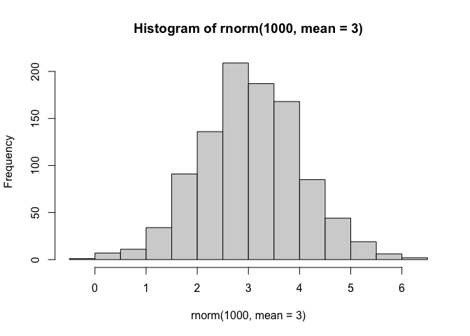
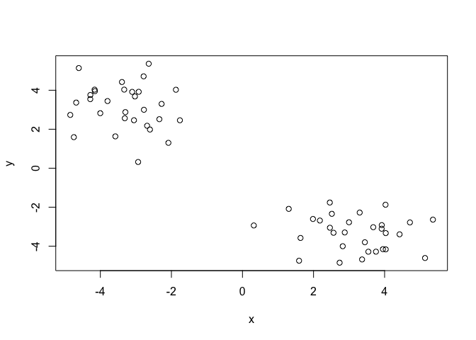
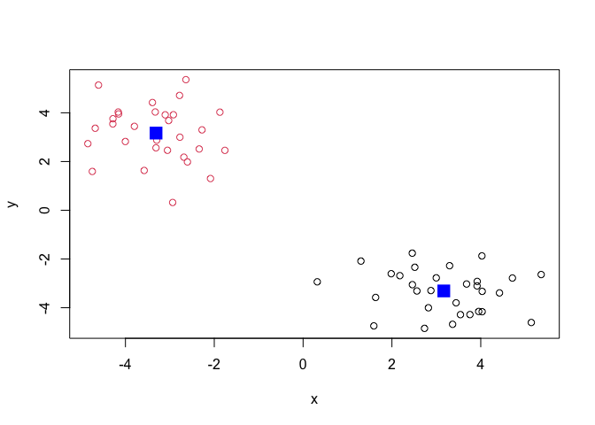
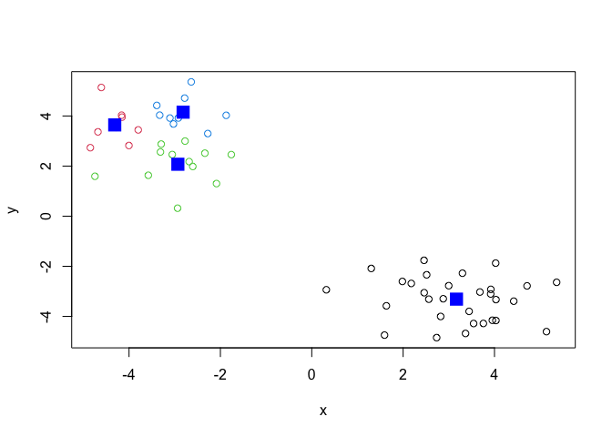
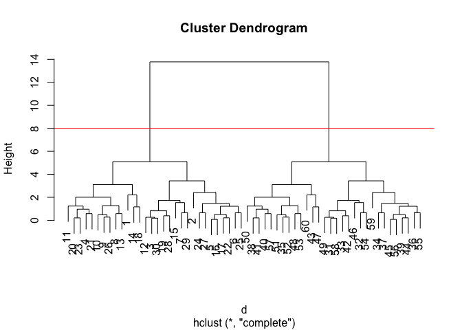
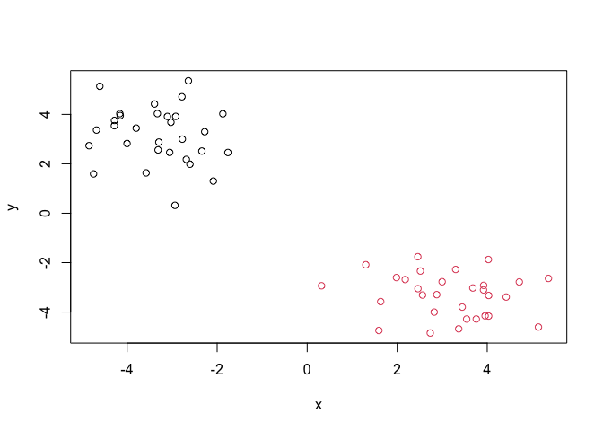
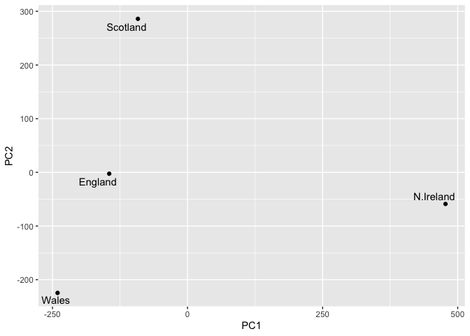

# Class 7: Machine Learning 1
Allen (A16897142)

- [Clustering](#clustering)
  - [K-means](#k-means)
  - [Hierarchal Clustering](#hierarchal-clustering)
- [Principal Component Analysis
  (PCA)](#principal-component-analysis-pca)
- [PCA to the rescue!](#pca-to-the-rescue)

We will be exploring unsupervised machine learning methods. The first
ones are clustering and dimensionality reduction.

## Clustering

Let’s make up some data to cluster where we know what the answer will
be. The `rnorm()` function will be able to help us.

``` r
hist(rnorm(1000,mean=3))
```



Now we want to return 30 numbers centered on -3

``` r
tmp <- c(rnorm (30,mean=-3),
rnorm (30, mean=+3))

x <- cbind(x=tmp,y=rev(tmp))

x
```

                   x          y
     [1,] -2.9370359  0.3187355
     [2,] -4.6067438  5.1379952
     [3,] -3.1047183  3.9169661
     [4,] -2.3394074  2.5153757
     [5,] -4.1535633  3.9531445
     [6,] -3.7986729  3.4444300
     [7,] -2.7821180  4.7129134
     [8,] -2.2758497  3.2988780
     [9,] -3.3126840  2.5623656
    [10,] -3.2956779  2.8784696
    [11,] -2.0852452  1.3022217
    [12,] -3.0270462  3.6808485
    [13,] -2.7740097  2.9981159
    [14,] -3.5783016  1.6330560
    [15,] -1.8733258  4.0259464
    [16,] -4.1622749  4.0316150
    [17,] -4.2813354  3.7569645
    [18,] -4.7460568  1.5927262
    [19,] -3.3285770  4.0326780
    [20,] -2.6042432  1.9840976
    [21,] -1.7610075  2.4579441
    [22,] -4.2838198  3.5430466
    [23,] -2.6845876  2.1785320
    [24,] -4.8468860  2.7340066
    [25,] -4.0021445  2.8215034
    [26,] -3.0539928  2.4607175
    [27,] -4.6804361  3.3662153
    [28,] -3.3924158  4.4214703
    [29,] -2.6387562  5.3603173
    [30,] -2.9204279  3.9200364
    [31,]  3.9200364 -2.9204279
    [32,]  5.3603173 -2.6387562
    [33,]  4.4214703 -3.3924158
    [34,]  3.3662153 -4.6804361
    [35,]  2.4607175 -3.0539928
    [36,]  2.8215034 -4.0021445
    [37,]  2.7340066 -4.8468860
    [38,]  2.1785320 -2.6845876
    [39,]  3.5430466 -4.2838198
    [40,]  2.4579441 -1.7610075
    [41,]  1.9840976 -2.6042432
    [42,]  4.0326780 -3.3285770
    [43,]  1.5927262 -4.7460568
    [44,]  3.7569645 -4.2813354
    [45,]  4.0316150 -4.1622749
    [46,]  4.0259464 -1.8733258
    [47,]  1.6330560 -3.5783016
    [48,]  2.9981159 -2.7740097
    [49,]  3.6808485 -3.0270462
    [50,]  1.3022217 -2.0852452
    [51,]  2.8784696 -3.2956779
    [52,]  2.5623656 -3.3126840
    [53,]  3.2988780 -2.2758497
    [54,]  4.7129134 -2.7821180
    [55,]  3.4444300 -3.7986729
    [56,]  3.9531445 -4.1535633
    [57,]  2.5153757 -2.3394074
    [58,]  3.9169661 -3.1047183
    [59,]  5.1379952 -4.6067438
    [60,]  0.3187355 -2.9370359

Now plot `x`

``` r
plot(x)
```



### K-means

Base R’s main function for K-means clustering is called `kmeans()`:

``` r
km <- kmeans(x,centers =2)
km
```

    K-means clustering with 2 clusters of sizes 30, 30

    Cluster means:
              x         y
    1  3.168044 -3.311045
    2 -3.311045  3.168044

    Clustering vector:
     [1] 2 2 2 2 2 2 2 2 2 2 2 2 2 2 2 2 2 2 2 2 2 2 2 2 2 2 2 2 2 2 1 1 1 1 1 1 1 1
    [39] 1 1 1 1 1 1 1 1 1 1 1 1 1 1 1 1 1 1 1 1 1 1

    Within cluster sum of squares by cluster:
    [1] 61.00707 61.00707
     (between_SS / total_SS =  91.2 %)

    Available components:

    [1] "cluster"      "centers"      "totss"        "withinss"     "tot.withinss"
    [6] "betweenss"    "size"         "iter"         "ifault"      

The`kmeans()`function is now able to return a list with 9 components and
you can see the named componenets of any list with `attribuets()`
function.

``` r
attributes(km)
```

    $names
    [1] "cluster"      "centers"      "totss"        "withinss"     "tot.withinss"
    [6] "betweenss"    "size"         "iter"         "ifault"      

    $class
    [1] "kmeans"

> How many points are in each cluster?

``` r
km$size
```

    [1] 30 30

> Cluster Membership/Assignment:

``` r
km$cluster
```

     [1] 2 2 2 2 2 2 2 2 2 2 2 2 2 2 2 2 2 2 2 2 2 2 2 2 2 2 2 2 2 2 1 1 1 1 1 1 1 1
    [39] 1 1 1 1 1 1 1 1 1 1 1 1 1 1 1 1 1 1 1 1 1 1

> Cluster center:

``` r
km$centers
```

              x         y
    1  3.168044 -3.311045
    2 -3.311045  3.168044

> Make a plot of `kmeans()` results showing cluster assignment using
> different colors for each group or points and cluster centers in blue.

``` r
plot(x,col=km$cluster)
points (km$centers,col="blue",pch=15, cex=2)
```



> Run `kmeans()` again on `x` and this cluster into 4 groups/clusters
> and plot the same resulting figure as above:

``` r
km4 <- kmeans(x,centers =4)
plot(x,col=km4$cluster)
points (km4$centers,col="blue",pch=15, cex=2)
```



> **key-point**: K-means clustering is super popular but can easily be
> misused. A limitation is that it can force a clustering pattern even
> if data shows an otherwise natural grouping that does not exist in
> terms of `centers`.

### Hierarchal Clustering

The main function in base R for Hierarchical Clustering is called
`hclust()`

Note: You can not just pass a data set as is into `hclust()`. You need
to give a distance matrix.

``` r
d <- dist(x)
hc <- hclust(d)
hc
```


    Call:
    hclust(d = d)

    Cluster method   : complete 
    Distance         : euclidean 
    Number of objects: 60 

The results of `hclust()` are not very useful typically. And there is no
useful `print()` method. However, there is a special `plot()`.

``` r
plot(hc)
abline(h=8,col="red")
```



To get our cluster assignment aka membership vector, you will need to
cut the tree at the goal posts in different areas.

``` r
grps <- cutree(hc, h=8)
grps
```

     [1] 1 1 1 1 1 1 1 1 1 1 1 1 1 1 1 1 1 1 1 1 1 1 1 1 1 1 1 1 1 1 2 2 2 2 2 2 2 2
    [39] 2 2 2 2 2 2 2 2 2 2 2 2 2 2 2 2 2 2 2 2 2 2

``` r
table(grps)
```

    grps
     1  2 
    30 30 

``` r
grps
```

     [1] 1 1 1 1 1 1 1 1 1 1 1 1 1 1 1 1 1 1 1 1 1 1 1 1 1 1 1 1 1 1 2 2 2 2 2 2 2 2
    [39] 2 2 2 2 2 2 2 2 2 2 2 2 2 2 2 2 2 2 2 2 2 2

``` r
plot(x, col=grps)
```



Hierarchical Clustering is distinct as the dendrogram can reveal groups
in your data that K-means clustering can not accomplish.

## Principal Component Analysis (PCA)

PCA is used as a dimensional reduction technique and to find which
dimension is the primary dimenstion in the data.

Data from the UK on food consumption will be used.

``` r
url <- "https://tinyurl.com/UK-foods"
x <- read.csv(url)
head(x)
```

                   X England Wales Scotland N.Ireland
    1         Cheese     105   103      103        66
    2  Carcass_meat      245   227      242       267
    3    Other_meat      685   803      750       586
    4           Fish     147   160      122        93
    5 Fats_and_oils      193   235      184       209
    6         Sugars     156   175      147       139

``` r
rownames(x) <- x[,1]
x <- x[,-1]
head(x)
```

                   England Wales Scotland N.Ireland
    Cheese             105   103      103        66
    Carcass_meat       245   227      242       267
    Other_meat         685   803      750       586
    Fish               147   160      122        93
    Fats_and_oils      193   235      184       209
    Sugars             156   175      147       139

``` r
url <- "https://tinyurl.com/UK-foods"
x <- read.csv(url, row.names=1)
head(x)
```

                   England Wales Scotland N.Ireland
    Cheese             105   103      103        66
    Carcass_meat       245   227      242       267
    Other_meat         685   803      750       586
    Fish               147   160      122        93
    Fats_and_oils      193   235      184       209
    Sugars             156   175      147       139

``` r
barplot(as.matrix(x), beside=T, col=rainbow(nrow(x)))
```


A “paris” plot can be useful as it compares two countries. Wherever the
country is on axis wise is where it is on the pairs plot.

``` r
pairs(x, col=rainbow(10), pch=16)
```


## PCA to the rescue!

The main function in base R for PCA is `prcomp()`.

``` r
## the PCA code
pca <- prcomp(t(x))
##overview of results
summary (pca)
```

    Importance of components:
                                PC1      PC2      PC3       PC4
    Standard deviation     324.1502 212.7478 73.87622 2.921e-14
    Proportion of Variance   0.6744   0.2905  0.03503 0.000e+00
    Cumulative Proportion    0.6744   0.9650  1.00000 1.000e+00

The `prcomp()`function returns a list object with our results.

``` r
attributes(pca)
```

    $names
    [1] "sdev"     "rotation" "center"   "scale"    "x"       

    $class
    [1] "prcomp"

The main results that we are looking for are `pca$x` and `pca$rotation`.
`pcz$x` contains the scores of data on the PC axis we use the make our
PCA plot with.

``` r
pca$x
```

                     PC1         PC2        PC3           PC4
    England   -144.99315   -2.532999 105.768945 -9.152022e-15
    Wales     -240.52915 -224.646925 -56.475555  5.560040e-13
    Scotland   -91.86934  286.081786 -44.415495 -6.638419e-13
    N.Ireland  477.39164  -58.901862  -4.877895  1.329771e-13

``` r
library(ggplot2)
library(ggrepel)

#Make a plot of pca$x with PC1 vs PC2

ggplot(pca$x)+
  aes(PC1, PC2, label=rownames(pca$x))+
  geom_point()+
  geom_text_repel()
```



Figure 1: Plot demonstrating different countries on their average food
group consumption aligned on PC1 axis vs PC2 axis using Principal
Component Analysis.

`pca$rotation` contains our second major result. To see what PCA is
picking up:

``` r
ggplot(pca$rotation)+
  aes(PC1,rownames(pca$rotation))+
  geom_col()
```


Figure 2: Barplot indicating which foods explains the trend on the PC
plot. If the bar is negative, that means it is more likely explained by
a negative country in the PC plot. If the bar is positive, that means it
is more likely explaied by a positive country in the PC plot.
