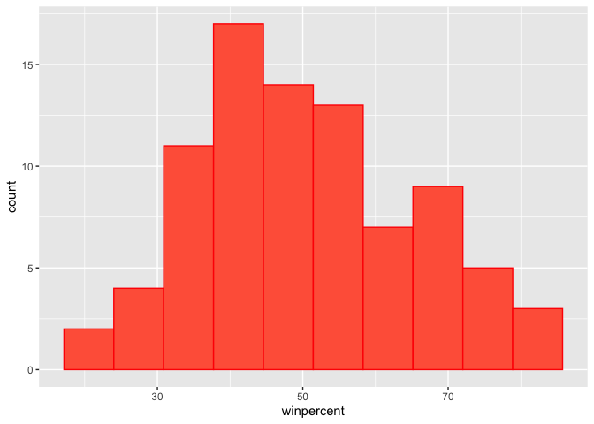
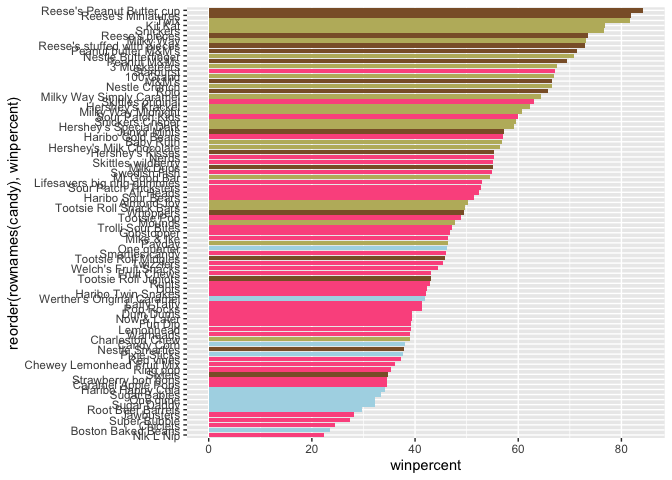
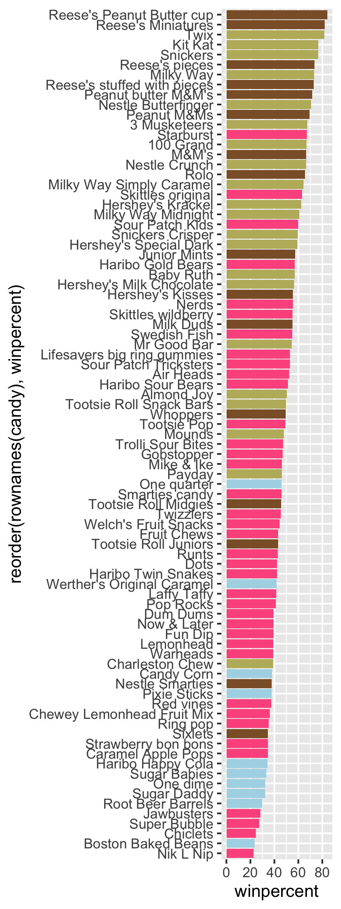
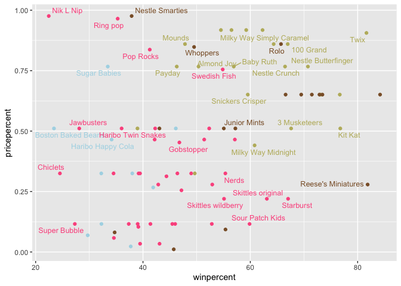
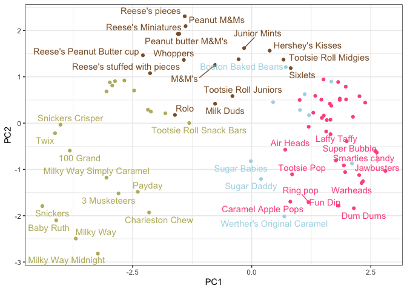
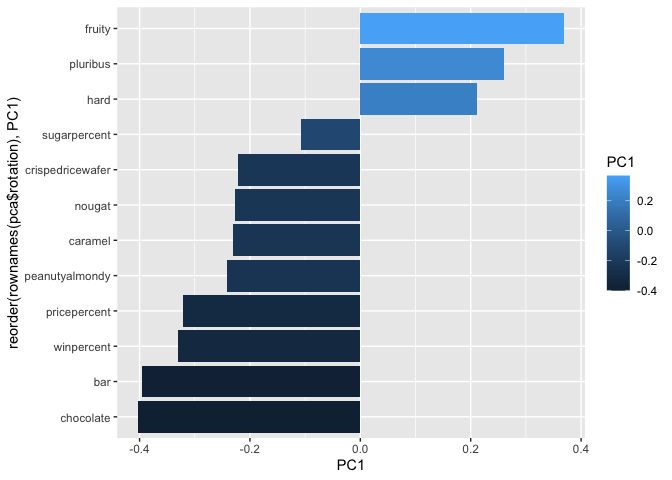

# Class 9 Halloween Candy
Allen (A16897142)

- [What is your favorite candy?](#what-is-your-favorite-candy)
- [Exploratory Analysis](#exploratory-analysis)
- [Overall Candy Rankings](#overall-candy-rankings)
- [Price Percent](#price-percent)
- [Correlation Structure](#correlation-structure)
- [Principal Component Analysis](#principal-component-analysis)

We will be using a halloween candy data to see the correlation between
structure and principal components of halloween candy.

``` r
url <- "https://raw.githubusercontent.com/fivethirtyeight/data/master/candy-power-ranking/candy-data.csv"
candy <- read.csv(url, row.names=1)
head(candy)
```

                 chocolate fruity caramel peanutyalmondy nougat crispedricewafer
    100 Grand            1      0       1              0      0                1
    3 Musketeers         1      0       0              0      1                0
    One dime             0      0       0              0      0                0
    One quarter          0      0       0              0      0                0
    Air Heads            0      1       0              0      0                0
    Almond Joy           1      0       0              1      0                0
                 hard bar pluribus sugarpercent pricepercent winpercent
    100 Grand       0   1        0        0.732        0.860   66.97173
    3 Musketeers    0   1        0        0.604        0.511   67.60294
    One dime        0   0        0        0.011        0.116   32.26109
    One quarter     0   0        0        0.011        0.511   46.11650
    Air Heads       0   0        0        0.906        0.511   52.34146
    Almond Joy      0   1        0        0.465        0.767   50.34755

> 1.  How many different candy types are in the dataset?

``` r
dim(candy)
```

    [1] 85 12

There are 85 different candies in this dataset.

> 2.  How many fruity candies are in the dataset?

``` r
sum(candy$fruity)
```

    [1] 38

There are 38 fruity candies.

## What is your favorite candy?

> 3.  What is your favorite candy in the dataset and what is it’s
>     “winpercent” value?

``` r
candy["Twix",]$winpercent
```

    [1] 81.64291

> 4.  What is the winpercent value for “Kit Kat”?

``` r
candy["Kit Kat",]$winpercent
```

    [1] 76.7686

> 5.  What is the winpercent value for “Tootsie Roll Snack Bars”?

``` r
candy["Tootsie Roll Snack Bars",]$winpercent
```

    [1] 49.6535

## Exploratory Analysis

We can use **skimr** to get an overview of a dataset. Espicially if you
are looking at a dataset for the first time.

``` r
library(skimr)
skimr::skim(candy)
```

|                                                  |       |
|:-------------------------------------------------|:------|
| Name                                             | candy |
| Number of rows                                   | 85    |
| Number of columns                                | 12    |
| \_\_\_\_\_\_\_\_\_\_\_\_\_\_\_\_\_\_\_\_\_\_\_   |       |
| Column type frequency:                           |       |
| numeric                                          | 12    |
| \_\_\_\_\_\_\_\_\_\_\_\_\_\_\_\_\_\_\_\_\_\_\_\_ |       |
| Group variables                                  | None  |

Data summary

**Variable type: numeric**

| skim_variable | n_missing | complete_rate | mean | sd | p0 | p25 | p50 | p75 | p100 | hist |
|:---|---:|---:|---:|---:|---:|---:|---:|---:|---:|:---|
| chocolate | 0 | 1 | 0.44 | 0.50 | 0.00 | 0.00 | 0.00 | 1.00 | 1.00 | ▇▁▁▁▆ |
| fruity | 0 | 1 | 0.45 | 0.50 | 0.00 | 0.00 | 0.00 | 1.00 | 1.00 | ▇▁▁▁▆ |
| caramel | 0 | 1 | 0.16 | 0.37 | 0.00 | 0.00 | 0.00 | 0.00 | 1.00 | ▇▁▁▁▂ |
| peanutyalmondy | 0 | 1 | 0.16 | 0.37 | 0.00 | 0.00 | 0.00 | 0.00 | 1.00 | ▇▁▁▁▂ |
| nougat | 0 | 1 | 0.08 | 0.28 | 0.00 | 0.00 | 0.00 | 0.00 | 1.00 | ▇▁▁▁▁ |
| crispedricewafer | 0 | 1 | 0.08 | 0.28 | 0.00 | 0.00 | 0.00 | 0.00 | 1.00 | ▇▁▁▁▁ |
| hard | 0 | 1 | 0.18 | 0.38 | 0.00 | 0.00 | 0.00 | 0.00 | 1.00 | ▇▁▁▁▂ |
| bar | 0 | 1 | 0.25 | 0.43 | 0.00 | 0.00 | 0.00 | 0.00 | 1.00 | ▇▁▁▁▂ |
| pluribus | 0 | 1 | 0.52 | 0.50 | 0.00 | 0.00 | 1.00 | 1.00 | 1.00 | ▇▁▁▁▇ |
| sugarpercent | 0 | 1 | 0.48 | 0.28 | 0.01 | 0.22 | 0.47 | 0.73 | 0.99 | ▇▇▇▇▆ |
| pricepercent | 0 | 1 | 0.47 | 0.29 | 0.01 | 0.26 | 0.47 | 0.65 | 0.98 | ▇▇▇▇▆ |
| winpercent | 0 | 1 | 50.32 | 14.71 | 22.45 | 39.14 | 47.83 | 59.86 | 84.18 | ▃▇▆▅▂ |

> Q6. Is there any variable/column that looks to be on a different scale
> to the majority of the other columns in the dataset?

The last column: `candy$winpercent` is a different scale compared to
other variables.

> Q7. What do you think a zero and one represent for the
> candy\$chocolate column?

Zeroes are candies that are not chocolate (false logical) while ones are
candies that are chocolate (true logical).

> Q8. Plot a histogram of winpercent values

``` r
library(ggplot2)
ggplot(candy)+
  aes(winpercent)+
  geom_histogram(bins=10,col="red",fill="tomato")
```



> Q9. Is the distribution of winpercent values symmetrical?

From the histogram, the distribution of winpercent is not symmetrical.

> Q10. Is the center of the distribution above or below 50%?

``` r
summary(candy$winpercent)
```

       Min. 1st Qu.  Median    Mean 3rd Qu.    Max. 
      22.45   39.14   47.83   50.32   59.86   84.18 

Around 50%, only slightly below (median is 47.83).

> Q11. On average is chocolate candy higher or lower ranked than fruit
> candy?

``` r
choc.inds <- candy$chocolate == 1
choc.candy <- candy[choc.inds,]
choc.win <- choc.candy$winpercent
mean(choc.win)
```

    [1] 60.92153

``` r
fruit.inds <- candy$fruity == 1
fruit.candy <- candy[fruit.inds,]
fruit.win <- fruit.candy$winpercent
mean(fruit.win)
```

    [1] 44.11974

The mean of winpercent of chocolate candy is higher, so it is ranked
higher than fruit candy.

> Q12. Is this difference statistically significant?

``` r
t.test(choc.win,fruit.win)
```


        Welch Two Sample t-test

    data:  choc.win and fruit.win
    t = 6.2582, df = 68.882, p-value = 2.871e-08
    alternative hypothesis: true difference in means is not equal to 0
    95 percent confidence interval:
     11.44563 22.15795
    sample estimates:
    mean of x mean of y 
     60.92153  44.11974 

With a p-value of 2.871e-08, we reject the null hypothesis, and that
there is a significant difference between the winpercents of chocolate
candies and fruity candies.

## Overall Candy Rankings

> Q13. What are the five least liked candy types in this set?

You can use either `sort()`function to help with sorting the data into
high and low. `Order()` will tell you how to rearrange it, the original
values place arranged in ascending order.

``` r
inds <- order(candy$winpercent)
##The 45th candy is the least liked candy
head(candy[inds,],5)
```

                       chocolate fruity caramel peanutyalmondy nougat
    Nik L Nip                  0      1       0              0      0
    Boston Baked Beans         0      0       0              1      0
    Chiclets                   0      1       0              0      0
    Super Bubble               0      1       0              0      0
    Jawbusters                 0      1       0              0      0
                       crispedricewafer hard bar pluribus sugarpercent pricepercent
    Nik L Nip                         0    0   0        1        0.197        0.976
    Boston Baked Beans                0    0   0        1        0.313        0.511
    Chiclets                          0    0   0        1        0.046        0.325
    Super Bubble                      0    0   0        0        0.162        0.116
    Jawbusters                        0    1   0        1        0.093        0.511
                       winpercent
    Nik L Nip            22.44534
    Boston Baked Beans   23.41782
    Chiclets             24.52499
    Super Bubble         27.30386
    Jawbusters           28.12744

> Q14. What are the top 5 all time favorite candy types out of this set?

``` r
inds <- order(candy$winpercent, decreasing=T)
head(candy[inds,],5)
```

                              chocolate fruity caramel peanutyalmondy nougat
    Reese's Peanut Butter cup         1      0       0              1      0
    Reese's Miniatures                1      0       0              1      0
    Twix                              1      0       1              0      0
    Kit Kat                           1      0       0              0      0
    Snickers                          1      0       1              1      1
                              crispedricewafer hard bar pluribus sugarpercent
    Reese's Peanut Butter cup                0    0   0        0        0.720
    Reese's Miniatures                       0    0   0        0        0.034
    Twix                                     1    0   1        0        0.546
    Kit Kat                                  1    0   1        0        0.313
    Snickers                                 0    0   1        0        0.546
                              pricepercent winpercent
    Reese's Peanut Butter cup        0.651   84.18029
    Reese's Miniatures               0.279   81.86626
    Twix                             0.906   81.64291
    Kit Kat                          0.511   76.76860
    Snickers                         0.651   76.67378

> Q15. Make a first barplot of candy ranking based on winpercent values.

``` r
ggplot(candy)+
aes(winpercent, rownames(candy)) +
  geom_col()
```


> Q16. This is quite ugly, use the reorder() function to get the bars
> sorted by winpercent?

``` r
ggplot(candy)+
aes(winpercent, reorder(rownames(candy),winpercent)) +
  geom_col()
```


Add some helpful custom color, and add color to help determine the type
of candy:

``` r
mycols <- rep("#ADD8E6",nrow(candy))
mycols[as.logical(candy$chocolate)] = "#8B5F33"
mycols[as.logical(candy$fruity)] = "#FC5A8D"
mycols[as.logical(candy$bar)] = "#BDB76B"

ggplot(candy)+
aes(winpercent, y=reorder(rownames(candy),winpercent)) +
  geom_col(fill=mycols)
```



``` r
ggsave("mybarplot.png", width=3, height=8)
```



> Q17. What is the worst ranked chocolate candy?

Worst ranked chocolate candy is sixlets

> Q18. What is the best ranked fruity candy?

Best ranked fruity candy is starbursts

## Price Percent

``` r
library(ggrepel)
ggplot(candy) +
  aes(winpercent, pricepercent, label=rownames(candy)) +
  geom_point(col=mycols) + 
  geom_text_repel(col=mycols, size=3.3, max.overlaps = 5)
```

    Warning: ggrepel: 50 unlabeled data points (too many overlaps). Consider
    increasing max.overlaps



> Q19. Which candy type is the highest ranked in terms of winpercent for
> the least money - i.e. offers the most bang for your buck?

Most bottom right have the highest win percent and lowest price. These
are Reece’s Minis, Starbursts, Skittles, Sour Patch Kids and Skittles
Wildberry

> Q20. What are the top 5 most expensive candy types in the dataset and
> of these which is the least popular?

Most top left have the lowest win percent, but the highest price. These
are Nik L Nip, Ring Pop, Nestle Smarties (my least favorite), Sugar
Babies, and Pop Rocks

## Correlation Structure

``` r
library(corrplot)
```

    corrplot 0.95 loaded

``` r
cij <- cor(candy)
corrplot (cij)
```


> Q22. Examining this plot what two variables are anti-correlated
> (i.e. have minus values)?

Fruity and Candy are the most anti-correlated. A value of -0.74. Closest
to negative 1.

``` r
cij["chocolate","fruity"]
```

    [1] -0.7417211

> Q23. Similarly, what two variables are most positively correlated?

Most correlated (aside from each other) is chocolate and bar (0.6) as
well as chocolate and winpercent (0.64), meaning that chocolate candies
are more popular.

``` r
cij["chocolate","bar"]
```

    [1] 0.5974211

``` r
cij["chocolate","winpercent"]
```

    [1] 0.6365167

## Principal Component Analysis

Time to scale our data `candy`.

``` r
pca <- prcomp(candy,scale=T)
summary(pca)
```

    Importance of components:
                              PC1    PC2    PC3     PC4    PC5     PC6     PC7
    Standard deviation     2.0788 1.1378 1.1092 1.07533 0.9518 0.81923 0.81530
    Proportion of Variance 0.3601 0.1079 0.1025 0.09636 0.0755 0.05593 0.05539
    Cumulative Proportion  0.3601 0.4680 0.5705 0.66688 0.7424 0.79830 0.85369
                               PC8     PC9    PC10    PC11    PC12
    Standard deviation     0.74530 0.67824 0.62349 0.43974 0.39760
    Proportion of Variance 0.04629 0.03833 0.03239 0.01611 0.01317
    Cumulative Proportion  0.89998 0.93832 0.97071 0.98683 1.00000

First result is the PCA plot:

``` r
library(ggrepel)
ggplot(pca$x)+
  aes(PC1,PC2, label=rownames(pca$x))+
  geom_point(col=mycols)+
  geom_text_repel(max.overlaps = 6, col=mycols)+
  theme_bw()
```

    Warning: ggrepel: 43 unlabeled data points (too many overlaps). Consider
    increasing max.overlaps



The second main PCA results is the `pca$rotation` plot. We plot this to
make a “loadings” plot.

``` r
ggplot(pca$rotation)+
  aes(PC1, reorder(rownames(pca$rotation),PC1), fill=PC1)+
  geom_col()
```



> Q24. What original variables are picked up strongly by PC1 in the
> positive direction? Do these make sense to you?

This plot shows that fruity, hard and pluribus contribute to PCA1 in the
positive direction. This shows they are correlated together, so that
makes sense that they are picked up strongly in the positive direction.
