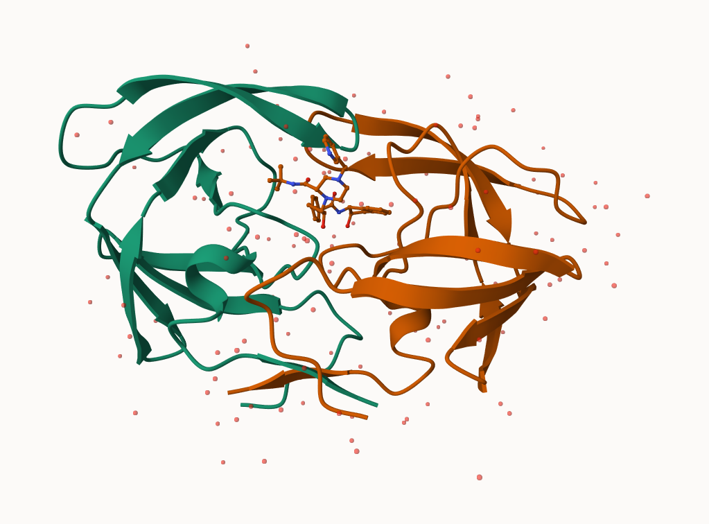

# Class 10: Structural Bioinformatics
Allen (A16897142)

- [PDB Database](#pdb-database)
- [Visualizing with Mol-star](#visualizing-with-mol-star)
- [Using bio3d package in R](#using-bio3d-package-in-r)
- [Predicting Functional Motions of a Single
  Structure](#predicting-functional-motions-of-a-single-structure)

## PDB Database

The [Protein Data Bank](https://www.rcsb.org/) (or PDB) is the second
oldest database and is the main one for biomolecular structure data.

``` r
stats <- read.csv("Data Export Summary.csv", row.names=1)
stats[] <- lapply(stats, function(x) as.numeric(gsub(",", "", x)))
head(stats)
```

                             X.ray    EM   NMR Multiple.methods Neutron Other
    Protein (only)          171959 18083 12622              210      84    32
    Protein/Oligosaccharide  10018  2968    34               10       2     0
    Protein/NA                8847  5376   286                7       0     0
    Nucleic acid (only)       2947   185  1535               14       3     1
    Other                      170    10    33                0       0     0
    Oligosaccharide (only)      11     0     6                1       0     4
                             Total
    Protein (only)          202990
    Protein/Oligosaccharide  13032
    Protein/NA               14516
    Nucleic acid (only)       4685
    Other                      213
    Oligosaccharide (only)      22

Here is how you write it as a function:

``` r
comma.sum <- function(x){
  y <- gsub(",","",x)
  ##G sub makes it , to no ,
  return (sum(as.numeric(y)))
}
```

> Q1: What percentage of structures in the PDB are solved by X-Ray and
> Electron Microscopy.

``` r
xray.sum <- comma.sum(stats$Neutron)
em.sum <- comma.sum(stats$EM)
total.sum <- comma.sum (stats$Total)
```

``` r
xray.sum/total.sum*100
```

    [1] 0.03779867

> Q2: What proportion of structures in the PDB are protein?

``` r
protein.sum <- stats["Protein (only)","Total"]
protein.sum/total.sum*100
```

    [1] 86.2107

86% of the structures are proteins.

## Visualizing with Mol-star

We will be analyzing the HIV-1 protease structure with PDB code: `1HSG`
Mol-star homepage at: https://molstar.org/viewer/.




## Using bio3d package in R

Bio3D package can help focus on structural bioinformatics analysis. It
allows us to read and analyze PDB data.

``` r
library (bio3d)
```

``` r
pdb <- read.pdb("1hsg")
```

      Note: Accessing on-line PDB file

``` r
pdb
```


     Call:  read.pdb(file = "1hsg")

       Total Models#: 1
         Total Atoms#: 1686,  XYZs#: 5058  Chains#: 2  (values: A B)

         Protein Atoms#: 1514  (residues/Calpha atoms#: 198)
         Nucleic acid Atoms#: 0  (residues/phosphate atoms#: 0)

         Non-protein/nucleic Atoms#: 172  (residues: 128)
         Non-protein/nucleic resid values: [ HOH (127), MK1 (1) ]

       Protein sequence:
          PQITLWQRPLVTIKIGGQLKEALLDTGADDTVLEEMSLPGRWKPKMIGGIGGFIKVRQYD
          QILIEICGHKAIGTVLVGPTPVNIIGRNLLTQIGCTLNFPQITLWQRPLVTIKIGGQLKE
          ALLDTGADDTVLEEMSLPGRWKPKMIGGIGGFIKVRQYDQILIEICGHKAIGTVLVGPTP
          VNIIGRNLLTQIGCTLNF

    + attr: atom, xyz, seqres, helix, sheet,
            calpha, remark, call

``` r
attributes(pdb)
```

    $names
    [1] "atom"   "xyz"    "seqres" "helix"  "sheet"  "calpha" "remark" "call"  

    $class
    [1] "pdb" "sse"

We will see atom data with `pdb$atom`

``` r
head(pdb$atom)
```

      type eleno elety  alt resid chain resno insert      x      y     z o     b
    1 ATOM     1     N <NA>   PRO     A     1   <NA> 29.361 39.686 5.862 1 38.10
    2 ATOM     2    CA <NA>   PRO     A     1   <NA> 30.307 38.663 5.319 1 40.62
    3 ATOM     3     C <NA>   PRO     A     1   <NA> 29.760 38.071 4.022 1 42.64
    4 ATOM     4     O <NA>   PRO     A     1   <NA> 28.600 38.302 3.676 1 43.40
    5 ATOM     5    CB <NA>   PRO     A     1   <NA> 30.508 37.541 6.342 1 37.87
    6 ATOM     6    CG <NA>   PRO     A     1   <NA> 29.296 37.591 7.162 1 38.40
      segid elesy charge
    1  <NA>     N   <NA>
    2  <NA>     C   <NA>
    3  <NA>     C   <NA>
    4  <NA>     O   <NA>
    5  <NA>     C   <NA>
    6  <NA>     C   <NA>

``` r
head(pdbseq(pdb))
```

      1   2   3   4   5   6 
    "P" "Q" "I" "T" "L" "W" 

We can make 3D visualizations we can use

``` r
#library(bio3dview)
#library(NGLVieweR)

#view.pdb(pdb, colorScheme = "sse", backgroundColor = "skyblue") |>
#  setSpin()
```

``` r
#library (bio3d)
#sel <- atom.select(pdb, resno=25)
#view.pdb(pdb, highlight = sel,
#         highlight.style = "spacefill")
```

## Predicting Functional Motions of a Single Structure

Normal Mode Analysis (NMA)

``` r
adk <- read.pdb("6s36")
```

      Note: Accessing on-line PDB file
       PDB has ALT records, taking A only, rm.alt=TRUE

``` r
m <- nma(adk)
```

     Building Hessian...        Done in 0.014 seconds.
     Diagonalizing Hessian...   Done in 0.282 seconds.

``` r
plot (m)
```


``` r
#view.nma(m)
```

We can write out a trajectory of predicted dynamics and view it in
Mol-star

``` r
#mktrj(m, file="nma.pdb")
```
