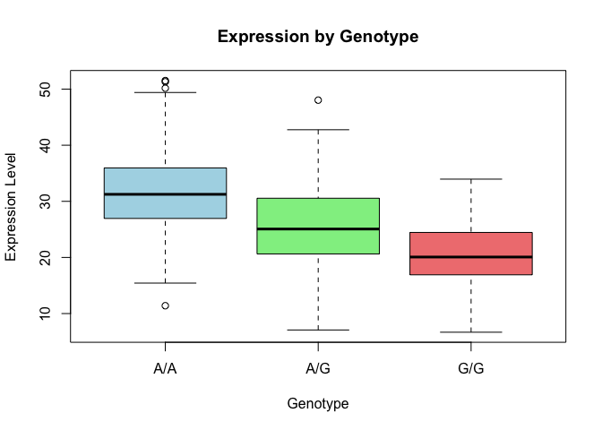

# Class 12: Genome Informatics Homework
Allen (A16897142)

``` r
genotype_results <- read.table("https://bioboot.github.io/bimm143_S25/class-material/rs8067378_ENSG00000172057.6.txt", 
                               header = TRUE, 
                               sep = "", 
                               stringsAsFactors = TRUE)
head(genotype_results)
```

       sample geno      exp
    1 HG00367  A/G 28.96038
    2 NA20768  A/G 20.24449
    3 HG00361  A/A 31.32628
    4 HG00135  A/A 34.11169
    5 NA18870  G/G 18.25141
    6 NA11993  A/A 32.89721

To find the sample size per genotype:

``` r
table(genotype_results$geno)
```


    A/A A/G G/G 
    108 233 121 

To find the corresponding median expression levels for genotype:

``` r
bp <- boxplot(exp ~ geno, data = genotype_results,
              main = "Expression by Genotype",
              xlab = "Genotype",
              ylab = "Expression Level",
              col = c("lightblue", "lightgreen", "lightcoral"))
```



``` r
data.frame(Genotype = levels(genotype_results$geno), Median = bp$stats[3, ])
```

      Genotype   Median
    1      A/A 31.24847
    2      A/G 25.06486
    3      G/G 20.07363

The genotype G/G has a higher expression level compared to A/A. It shows
that SNP affects the expression level of ORMDL3.
