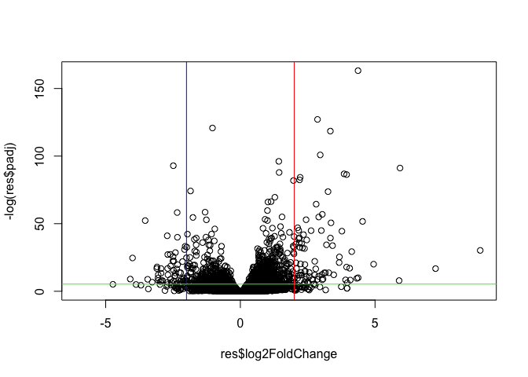

# Class 13: DESeq2
Allen (A16897142)

- [Background](#background)
- [Toy differential gene expression](#toy-differential-gene-expression)
- [Results Figure: Volcano Plot](#results-figure-volcano-plot)
  - [Day 2 Class 14:](#day-2-class-14)
- [Pathway Analysis](#pathway-analysis)

# Background

We will be analyzing some RNA Sequencing data on the effects of steroid
drugs on airway cells in the lungs.

There are two main inputs we need for the analysis. These are: -
`countData`: counts for genes in rows with experiments in the columns -
`colData`: or metadata that tells us about the design of the experiment.
Or what is in the columns of countData

``` r
counts <- read.csv("airway_scaledcounts.csv",row.names = 1)
metadata <- read.csv("airway_metadata.csv")
```

> Q1. How many genes are in this dataset?

``` r
nrow(counts)
```

    [1] 38694

> Q2. How many ‘control’ cell lines do we have?

``` r
metadata$dex
```

    [1] "control" "treated" "control" "treated" "control" "treated" "control"
    [8] "treated"

``` r
sum(metadata$dex == "control")
```

    [1] 4

# Toy differential gene expression

Let’s try finding the average of the “control” and “treated” columns to
see any difference.

1.  Find the control columns.
2.  Extract the genes that have “control” values.
3.  Calculate the `mean()` for each gene.

``` r
all(colnames(counts) == metadata$id)
```

    [1] TRUE

The \$dex columns tells me whether we have “control” or “treated”

``` r
control.inds <- metadata$dex == "control"
```

This is step 2. Extracting the control values.

``` r
control.counts <- counts[,control.inds]
```

Step 3. Calculate the mean value for each gene in these control columns

``` r
control.mean <- rowMeans(control.counts)
```

> Q3. Do the same for “treatment” values

``` r
treated.inds <- metadata$dex == "treated"
```

``` r
treated.counts <- counts[,treated.inds]
```

``` r
treated.mean <- rowMeans(treated.counts)
```

> Q4. Make a plot of `control.mean` vs `treated.mean`

``` r
meancounts <- data.frame(control.mean, treated.mean)
head(meancounts)
```

                    control.mean treated.mean
    ENSG00000000003       900.75       658.00
    ENSG00000000005         0.00         0.00
    ENSG00000000419       520.50       546.00
    ENSG00000000457       339.75       316.50
    ENSG00000000460        97.25        78.75
    ENSG00000000938         0.75         0.00

``` r
library(ggplot2)

ggplot(meancounts)+
  aes(control.mean,treated.mean)+
  geom_point(alpha=0.3)
```


And now we can see there are so many points and it is very skewed to the
beginning. We use the log function.

``` r
library(ggplot2)

ggplot(meancounts)+
  aes(control.mean,treated.mean)+
  geom_point(alpha=0.3)+
  scale_x_log10() +
  scale_y_log10() 
```

    Warning in scale_x_log10(): log-10 transformation introduced infinite values.

    Warning in scale_y_log10(): log-10 transformation introduced infinite values.


\#TREATED/CONTROL

``` r
log2(20/20)
```

    [1] 0

Doubling (1)

``` r
log2(40/20)
```

    [1] 1

Halving (-1)

``` r
log2(20/40)
```

    [1] -1

So now we will focus only on the genes with a log2 “fold-change” of +2
as so-called UP REGULATED and -2 as DOWN REGULATED

Log2 fold change value to our `meancounts`data.frame:

``` r
meancounts$log2fc <- log2(meancounts$treated.mean/meancounts$control.mean)

head(meancounts)
```

                    control.mean treated.mean      log2fc
    ENSG00000000003       900.75       658.00 -0.45303916
    ENSG00000000005         0.00         0.00         NaN
    ENSG00000000419       520.50       546.00  0.06900279
    ENSG00000000457       339.75       316.50 -0.10226805
    ENSG00000000460        97.25        78.75 -0.30441833
    ENSG00000000938         0.75         0.00        -Inf

> Q. Remove any “zero count” genes from our dataset to help with further
> analysis.

``` r
to.keep <- rowSums(meancounts[,1:2]== 0)== 0
sum(to.keep)
```

    [1] 21817

``` r
mycounts <- meancounts[to.keep,]
head(mycounts)
```

                    control.mean treated.mean      log2fc
    ENSG00000000003       900.75       658.00 -0.45303916
    ENSG00000000419       520.50       546.00  0.06900279
    ENSG00000000457       339.75       316.50 -0.10226805
    ENSG00000000460        97.25        78.75 -0.30441833
    ENSG00000000971      5219.00      6687.50  0.35769358
    ENSG00000001036      2327.00      1785.75 -0.38194109

> Q. How many genes are “up regulated” at a log2fc threshold of +2?

``` r
sum(mycounts$log2fc >= 2)
```

    [1] 314

> Q. How many genes are “down regulated” at a log2fc threshold of -2?

``` r
sum(mycounts$log2fc <= -2)
```

    [1] 485

> Q. Do we trust these results?

We do not trust these results because there is no statistical evidence
to tell us what is significant or not. DESeq2 will help us.

``` r
library(DESeq2)
```

``` r
dds <- DESeqDataSetFromMatrix(countData = counts,
                       colData = metadata,
                       design = ~dex)
```

    converting counts to integer mode

    Warning in DESeqDataSet(se, design = design, ignoreRank): some variables in
    design formula are characters, converting to factors

We can now run our DESeq analysis

``` r
dds <- DESeq(dds)
```

    estimating size factors

    estimating dispersions

    gene-wise dispersion estimates

    mean-dispersion relationship

    final dispersion estimates

    fitting model and testing

``` r
res <- results(dds)
```

To see the results:

``` r
head(res)
```

    log2 fold change (MLE): dex treated vs control 
    Wald test p-value: dex treated vs control 
    DataFrame with 6 rows and 6 columns
                      baseMean log2FoldChange     lfcSE      stat    pvalue
                     <numeric>      <numeric> <numeric> <numeric> <numeric>
    ENSG00000000003 747.194195     -0.3507030  0.168246 -2.084470 0.0371175
    ENSG00000000005   0.000000             NA        NA        NA        NA
    ENSG00000000419 520.134160      0.2061078  0.101059  2.039475 0.0414026
    ENSG00000000457 322.664844      0.0245269  0.145145  0.168982 0.8658106
    ENSG00000000460  87.682625     -0.1471420  0.257007 -0.572521 0.5669691
    ENSG00000000938   0.319167     -1.7322890  3.493601 -0.495846 0.6200029
                         padj
                    <numeric>
    ENSG00000000003  0.163035
    ENSG00000000005        NA
    ENSG00000000419  0.176032
    ENSG00000000457  0.961694
    ENSG00000000460  0.815849
    ENSG00000000938        NA

# Results Figure: Volcano Plot

Figure 1: Plot of the P-Value vs the log2FC

``` r
plot(res$log2FoldChange,log(res$padj))
```


``` r
log(0.3)
```

    [1] -1.203973

``` r
log(0.00000000001)
```

    [1] -25.32844

We can flip the y-axis by adding a minus sign and help make it easy to
interpret the data.

``` r
plot(res$log2FoldChange,-log(res$padj))
abline(v=-2, col="blue")
abline(v=+2, col="red")
abline(h=-log(0.005),col="green")
```



Time to add some color!

``` r
mycols <- rep("gray", nrow(res))
mycols[res$log2FoldChange <= -2] <- "lightcoral"
mycols[res$log2FoldChange >= 2] <- "lightcoral"
mycols[res$padj >= 0.005] <- "gray"
plot(res$log2FoldChange,-log(res$padj),col=mycols)
abline(v=-2, col="lightcoral")
abline(v=+2, col="lightcoral")
abline(h=-log(0.005),col="lightcoral")
```


> Make a ggplot volcano plot with colors and lines as anootation along
> with nice axis labels.

``` r
ggplot(as.data.frame(res))+
  aes(res$log2FoldChange,res$padj)+
  geom_point()+
  scale_y_log10()
```

    Warning: Removed 23549 rows containing missing values or values outside the scale range
    (`geom_point()`).


``` r
ggplot(as.data.frame(res))+
  aes(log2FoldChange, -log10(padj)) +
  geom_point(col=mycols) +
  scale_color_manual(values = c("gray", "lightcoral")) +
  geom_vline(xintercept = (-2), color = "lightcoral") +    
  geom_vline(xintercept = (2), color = "lightcoral") +
  geom_hline(yintercept = -log10(0.005), color = "lightcoral") +
  labs(x = "log2 Fold Change", y = "-log10 Adjusted P-value", title = "Volcano Plot Depicting Regulation of Genes on a Treatment")+
  theme_bw()
```

    Warning: Removed 23549 rows containing missing values or values outside the scale range
    (`geom_point()`).


## Day 2 Class 14:

First we want to add gene symbols (e.g. HBB for hemoglobin) so we know
the genes we are working with. We will be translating between ENSEMBLE
ids where we have rownames in.

``` r
head(rownames(res))
```

    [1] "ENSG00000000003" "ENSG00000000005" "ENSG00000000419" "ENSG00000000457"
    [5] "ENSG00000000460" "ENSG00000000938"

The following are installed from bioconductor with
`BiocManager::install("AnnotationDbi")`

``` r
library(AnnotationDbi)
library(org.Hs.eg.db)
```

``` r
columns(org.Hs.eg.db)
```

     [1] "ACCNUM"       "ALIAS"        "ENSEMBL"      "ENSEMBLPROT"  "ENSEMBLTRANS"
     [6] "ENTREZID"     "ENZYME"       "EVIDENCE"     "EVIDENCEALL"  "GENENAME"    
    [11] "GENETYPE"     "GO"           "GOALL"        "IPI"          "MAP"         
    [16] "OMIM"         "ONTOLOGY"     "ONTOLOGYALL"  "PATH"         "PFAM"        
    [21] "PMID"         "PROSITE"      "REFSEQ"       "SYMBOL"       "UCSCKG"      
    [26] "UNIPROT"     

``` r
##Anotating the genes in different databases
res$name <- mapIds(x=org.Hs.eg.db,
                    keys=rownames(res),
                    keytype = "ENSEMBL",
                   column = "SYMBOL")
```

    'select()' returned 1:many mapping between keys and columns

``` r
res$entrez <- mapIds(x=org.Hs.eg.db,
                    keys=rownames(res),
                    keytype = "ENSEMBL",
                   column = "ENTREZID")
```

    'select()' returned 1:many mapping between keys and columns

``` r
head(res)
```

    log2 fold change (MLE): dex treated vs control 
    Wald test p-value: dex treated vs control 
    DataFrame with 6 rows and 8 columns
                      baseMean log2FoldChange     lfcSE      stat    pvalue
                     <numeric>      <numeric> <numeric> <numeric> <numeric>
    ENSG00000000003 747.194195     -0.3507030  0.168246 -2.084470 0.0371175
    ENSG00000000005   0.000000             NA        NA        NA        NA
    ENSG00000000419 520.134160      0.2061078  0.101059  2.039475 0.0414026
    ENSG00000000457 322.664844      0.0245269  0.145145  0.168982 0.8658106
    ENSG00000000460  87.682625     -0.1471420  0.257007 -0.572521 0.5669691
    ENSG00000000938   0.319167     -1.7322890  3.493601 -0.495846 0.6200029
                         padj        name      entrez
                    <numeric> <character> <character>
    ENSG00000000003  0.163035      TSPAN6        7105
    ENSG00000000005        NA        TNMD       64102
    ENSG00000000419  0.176032        DPM1        8813
    ENSG00000000457  0.961694       SCYL3       57147
    ENSG00000000460  0.815849       FIRRM       55732
    ENSG00000000938        NA         FGR        2268

Let’s save our annotated results to a file!

``` r
write.csv(res, file="my_annotated_results.csv")
```

# Pathway Analysis

Install the packages we need to be able to do our pathway analysis:: Run
in the R console.
`BiocManager::install(c("pathview","gage","gageData"))`

``` r
library(gage)
```

``` r
library(gageData)
library(pathview)
```

    ##############################################################################
    Pathview is an open source software package distributed under GNU General
    Public License version 3 (GPLv3). Details of GPLv3 is available at
    http://www.gnu.org/licenses/gpl-3.0.html. Particullary, users are required to
    formally cite the original Pathview paper (not just mention it) in publications
    or products. For details, do citation("pathview") within R.

    The pathview downloads and uses KEGG data. Non-academic uses may require a KEGG
    license agreement (details at http://www.kegg.jp/kegg/legal.html).
    ##############################################################################

``` r
data(kegg.sets.hs)
# Examine the first 3 pathways
head(kegg.sets.hs, 3)
```

    $`hsa00232 Caffeine metabolism`
    [1] "10"   "1544" "1548" "1549" "1553" "7498" "9"   

    $`hsa00983 Drug metabolism - other enzymes`
     [1] "10"     "1066"   "10720"  "10941"  "151531" "1548"   "1549"   "1551"  
     [9] "1553"   "1576"   "1577"   "1806"   "1807"   "1890"   "221223" "2990"  
    [17] "3251"   "3614"   "3615"   "3704"   "51733"  "54490"  "54575"  "54576" 
    [25] "54577"  "54578"  "54579"  "54600"  "54657"  "54658"  "54659"  "54963" 
    [33] "574537" "64816"  "7083"   "7084"   "7172"   "7363"   "7364"   "7365"  
    [41] "7366"   "7367"   "7371"   "7372"   "7378"   "7498"   "79799"  "83549" 
    [49] "8824"   "8833"   "9"      "978"   

    $`hsa01100 Metabolic pathways`
       [1] "10"        "100"       "10007"     "100137049" "10020"     "10026"    
       [7] "100510686" "10063"     "10157"     "10170"     "10195"     "10201"    
      [13] "10229"     "10312"     "10317"     "10327"     "10331"     "1036"     
      [19] "10380"     "10390"     "1040"      "10400"     "10402"     "10423"    
      [25] "10449"     "10476"     "10554"     "10555"     "10558"     "1056"     
      [31] "10588"     "10606"     "10621"     "10622"     "10623"     "10632"    
      [37] "10654"     "1066"      "10678"     "10682"     "10690"     "10714"    
      [43] "10720"     "10768"     "10797"     "10826"     "10841"     "10855"    
      [49] "10873"     "10901"     "10905"     "10941"     "10975"     "10993"    
      [55] "10998"     "11019"     "11041"     "1109"      "11112"     "11128"    
      [61] "1119"      "1120"      "11226"     "11227"     "11232"     "112483"   
      [67] "11253"     "11282"     "11285"     "113026"    "11320"     "11343"    
      [73] "113451"    "113612"    "114805"    "1152"      "1158"      "1159"     
      [79] "1160"      "116285"    "117248"    "119548"    "120227"    "121278"   
      [85] "122481"    "122622"    "123099"    "123745"    "123876"    "124"      
      [91] "124454"    "124975"    "125"       "125061"    "125965"    "125981"   
      [97] "126"       "126328"    "126792"    "127"       "127124"    "128"      
     [103] "128869"    "129607"    "129642"    "130"       "130013"    "131"      
     [109] "1312"      "131669"    "132"       "132158"    "1327"      "132789"   
     [115] "1329"      "1337"      "1339"      "1340"      "134147"    "1345"     
     [121] "1349"      "1350"      "1351"      "135152"    "1352"      "1353"     
     [127] "1355"      "1371"      "1373"      "137964"    "138050"    "138429"   
     [133] "139596"    "140838"    "1431"      "144193"    "144245"    "145226"   
     [139] "146664"    "1491"      "15"        "1503"      "150763"    "151056"   
     [145] "151531"    "1537"      "154141"    "1543"      "1544"      "1548"     
     [151] "1549"      "155066"    "1551"      "1553"      "1555"      "1557"     
     [157] "1558"      "1559"      "1562"      "1571"      "1573"      "157506"   
     [163] "1576"      "1577"      "1579"      "158"       "1581"      "1582"     
     [169] "1583"      "1584"      "1585"      "1586"      "1588"      "1589"     
     [175] "159"       "1593"      "1594"      "1595"      "160287"    "1603"     
     [181] "1606"      "1607"      "1608"      "160851"    "1609"      "1610"     
     [187] "1621"      "162417"    "162466"    "1629"      "1633"      "1635"     
     [193] "1638"      "1644"      "1650"      "166929"    "168391"    "169355"   
     [199] "170712"    "171568"    "1716"      "1717"      "1718"      "1719"     
     [205] "1723"      "1737"      "1738"      "1743"      "1757"      "178"      
     [211] "1786"      "1787"      "1788"      "1789"      "1798"      "18"       
     [217] "1806"      "1807"      "1841"      "1854"      "189"       "1890"     
     [223] "1892"      "191"       "192134"    "1962"      "197258"    "199857"   
     [229] "201595"    "2023"      "2026"      "2027"      "203"       "204"      
     [235] "205"       "2053"      "2058"      "210"       "211"       "212"      
     [241] "2131"      "2132"      "2134"      "2135"      "2137"      "216"      
     [247] "217"       "218"       "2180"      "2181"      "2182"      "2184"     
     [253] "219"       "2194"      "220"       "2203"      "221"       "221223"   
     [259] "221823"    "222"       "2222"      "2224"      "223"       "2235"     
     [265] "224"       "226"       "2271"      "22845"     "22856"     "229"      
     [271] "22928"     "22929"     "22934"     "22978"     "230"       "23057"    
     [277] "231"       "23193"     "23236"     "23305"     "23382"     "23396"    
     [283] "23417"     "23475"     "23483"     "23498"     "23530"     "23545"    
     [289] "23553"     "23556"     "2356"      "23600"     "23649"     "23761"    
     [295] "239"       "240"       "242"       "245972"    "245973"    "246"      
     [301] "246721"    "247"       "248"       "249"       "250"       "251"      
     [307] "2523"      "2524"      "2525"      "2526"      "2527"      "2528"     
     [313] "2529"      "2530"      "2531"      "253558"    "2538"      "2539"     
     [319] "254531"    "2548"      "256435"    "2571"      "2572"      "25796"    
     [325] "2581"      "2582"      "2583"      "25834"     "2584"      "2585"     
     [331] "2588"      "25885"     "2589"      "2590"      "25902"     "2591"     
     [337] "2592"      "259230"    "2593"      "259307"    "2595"      "2597"     
     [343] "26007"     "26035"     "2618"      "262"       "26227"     "26229"    
     [349] "26275"     "26279"     "2628"      "26289"     "2629"      "26290"    
     [355] "26301"     "2632"      "26330"     "2639"      "2643"      "2645"     
     [361] "2650"      "2651"      "2673"      "2678"      "2683"      "2686"     
     [367] "2687"      "270"       "27010"     "27034"     "27087"     "27089"    
     [373] "27090"     "271"       "2710"      "2712"      "27124"     "27165"    
     [379] "272"       "2720"      "27235"     "2729"      "2730"      "27306"    
     [385] "2731"      "27349"     "27430"     "2744"      "2746"      "2747"     
     [391] "275"       "2752"      "276"       "2762"      "277"       "278"      
     [397] "279"       "2799"      "28"        "280"       "2805"      "2806"     
     [403] "2821"      "283208"    "283871"    "284098"    "284541"    "2875"     
     [409] "290"       "29071"     "2937"      "2954"      "29796"     "2987"     
     [415] "29880"     "2990"      "29906"     "29920"     "29922"     "29925"    
     [421] "29926"     "29929"     "29947"     "29958"     "29968"     "30"       
     [427] "3028"      "3030"      "3032"      "3033"      "3034"      "3067"     
     [433] "3073"      "3074"      "3081"      "30814"     "30815"     "30833"    
     [439] "30834"     "3098"      "3099"      "31"        "3101"      "314"      
     [445] "3141"      "3145"      "3155"      "3156"      "3157"      "3158"     
     [451] "316"       "317749"    "32"        "3242"      "3251"      "326625"   
     [457] "3283"      "3284"      "3290"      "3291"      "3292"      "3293"     
     [463] "3294"      "3295"      "33"        "3340"      "3373"      "337876"   
     [469] "339221"    "34"        "340485"    "341392"    "3417"      "3418"     
     [475] "3419"      "341947"    "3420"      "3421"      "3422"      "3423"     
     [481] "3425"      "348158"    "349565"    "35"        "353"       "36"       
     [487] "3612"      "3613"      "3614"      "3615"      "3620"      "3628"     
     [493] "3631"      "3632"      "3633"      "3636"      "37"        "3703"     
     [499] "3704"      "3705"      "3706"      "3707"      "3712"      "374291"   
     [505] "374378"    "3795"      "38"        "383"       "384"       "387787"   
     [511] "39"        "3906"      "391013"    "3938"      "3939"      "3945"     
     [517] "3948"      "3990"      "4047"      "4048"      "4051"      "4056"     
     [523] "411"       "4121"      "4122"      "4124"      "4128"      "4129"     
     [529] "4143"      "4144"      "4190"      "4191"      "4199"      "4245"     
     [535] "4247"      "4248"      "4249"      "427"       "4329"      "435"      
     [541] "4351"      "4357"      "438"       "440"       "440138"    "440567"   
     [547] "441024"    "441531"    "442117"    "445"       "4507"      "4508"     
     [553] "4509"      "4512"      "4513"      "4514"      "4519"      "4522"     
     [559] "4524"      "4535"      "4536"      "4537"      "4538"      "4539"     
     [565] "4540"      "4541"      "4548"      "4594"      "4597"      "4598"     
     [571] "4669"      "4694"      "4695"      "4696"      "4697"      "4698"     
     [577] "47"        "4700"      "4701"      "4702"      "4704"      "4705"     
     [583] "4706"      "4707"      "4708"      "4709"      "471"       "4710"     
     [589] "4711"      "4712"      "4713"      "4714"      "4715"      "4716"     
     [595] "4717"      "4718"      "4719"      "4720"      "4722"      "4723"     
     [601] "4724"      "4725"      "4726"      "4728"      "4729"      "4731"     
     [607] "48"        "4830"      "4831"      "4832"      "4833"      "4837"     
     [613] "4842"      "4843"      "4846"      "4860"      "4907"      "493911"   
     [619] "4942"      "4952"      "4953"      "4967"      "498"       "50"       
     [625] "5009"      "501"       "5033"      "5048"      "50484"     "50487"    
     [631] "5049"      "5050"      "5051"      "5053"      "506"       "50614"    
     [637] "50617"     "50700"     "50814"     "509"       "5091"      "5095"     
     [643] "5096"      "51"        "51004"     "5105"      "51056"     "5106"     
     [649] "51074"     "51082"     "51084"     "51102"     "51109"     "51144"    
     [655] "51166"     "51179"     "51181"     "51196"     "51227"     "51251"    
     [661] "51268"     "513"       "5130"      "51301"     "51380"     "51382"    
     [667] "514"       "51477"     "51478"     "515"       "51540"     "516"      
     [673] "5160"      "51601"     "51604"     "51606"     "5161"      "5162"     
     [679] "5167"      "5169"      "517"       "51703"     "51727"     "51728"    
     [685] "51733"     "51763"     "518"       "51805"     "51809"     "5198"     
     [691] "521"       "5211"      "5213"      "5214"      "522"       "5223"     
     [697] "5224"      "5226"      "523"       "5230"      "5232"      "5236"     
     [703] "525"       "526"       "527"       "5277"      "5279"      "528"      
     [709] "5281"      "5283"      "5286"      "5287"      "5288"      "5289"     
     [715] "529"       "5297"      "5298"      "5313"      "5315"      "5319"     
     [721] "5320"      "5321"      "5322"      "533"       "5330"      "5331"     
     [727] "5332"      "5333"      "5335"      "53354"     "5336"      "5337"     
     [733] "5338"      "534"       "535"       "53630"     "537"       "5372"     
     [739] "5373"      "539"       "53947"     "5406"      "5407"      "5408"     
     [745] "5409"      "54107"     "54187"     "5422"      "5424"      "5425"     
     [751] "5426"      "5427"      "5428"      "5430"      "5431"      "5432"     
     [757] "5433"      "5434"      "54344"     "5435"      "5436"      "54363"    
     [763] "5437"      "5438"      "5439"      "5440"      "5441"      "5444"     
     [769] "5445"      "5446"      "54480"     "54490"     "54575"     "54576"    
     [775] "54577"     "54578"     "54579"     "54600"     "54657"     "54658"    
     [781] "54659"     "54675"     "5471"      "54802"     "548596"    "548644"   
     [787] "549"       "54947"     "54963"     "54965"     "5498"      "54988"    
     [793] "54995"     "55163"     "55191"     "55224"     "55229"     "55256"    
     [799] "55276"     "55300"     "55301"     "55304"     "55312"     "55361"    
     [805] "5538"      "55454"     "55500"     "55512"     "55568"     "5557"     
     [811] "5558"      "55627"     "55650"     "55703"     "55750"     "55753"    
     [817] "55790"     "55808"     "55821"     "55902"     "55907"     "56052"    
     [823] "5625"      "56267"     "5631"      "5634"      "56474"     "56623"    
     [829] "56624"     "56655"     "56848"     "56894"     "56895"     "56898"    
     [835] "56901"     "56913"     "56922"     "56953"     "56994"     "570"      
     [841] "57016"     "57026"     "57134"     "5723"      "5730"      "5740"     
     [847] "5742"      "5743"      "57452"     "574537"    "57678"     "57804"    
     [853] "57818"     "57834"     "5805"      "5831"      "5832"      "5833"     
     [859] "58510"     "5859"      "586"       "5860"      "587"       "593"      
     [865] "594"       "5980"      "60490"     "60495"     "6120"      "6184"     
     [871] "6185"      "622"       "6240"      "6241"      "6296"      "6303"     
     [877] "6307"      "6309"      "6342"      "635"       "6389"      "6390"     
     [883] "6391"      "63917"     "6392"      "64087"     "64131"     "64132"    
     [889] "64409"     "64425"     "6448"      "64579"     "64600"     "646625"   
     [895] "6470"      "6472"      "6476"      "64768"     "6480"      "64802"    
     [901] "64816"     "6482"      "6483"      "6484"      "6487"      "6489"     
     [907] "64902"     "65220"     "65263"     "654364"    "6609"      "661"      
     [913] "6610"      "6611"      "6652"      "6675"      "6677"      "669"      
     [919] "6697"      "6713"      "6718"      "6723"      "683"       "686"      
     [925] "6888"      "6898"      "6916"      "6999"      "7054"      "7083"     
     [931] "7084"      "7086"      "7108"      "7166"      "7167"      "7173"     
     [937] "7263"      "7264"      "729020"    "7298"      "7299"      "7306"     
     [943] "7357"      "7358"      "7360"      "7363"      "7364"      "7365"     
     [949] "7366"      "7367"      "7368"      "7371"      "7372"      "7378"     
     [955] "7381"      "7384"      "7385"      "7386"      "7388"      "7389"     
     [961] "7390"      "7498"      "7841"      "790"       "79053"     "79087"    
     [967] "7915"      "79178"     "7923"      "79369"     "7941"      "79586"    
     [973] "79611"     "79623"     "79646"     "79695"     "79717"     "79796"    
     [979] "79799"     "79814"     "79868"     "79888"     "7991"      "80025"    
     [985] "80055"     "80142"     "80146"     "80201"     "80270"     "80308"    
     [991] "80339"     "80347"     "8050"      "81490"     "81579"     "81616"    
     [997] "81849"     "81888"     "8277"      "8309"      "8310"      "83440"    
    [1003] "83549"     "8372"      "8382"      "8394"      "8395"      "8398"     
    [1009] "8399"      "84002"     "84076"     "84172"     "84245"     "84265"    
    [1015] "84274"     "84284"     "84532"     "84618"     "84620"     "84647"    
    [1021] "84649"     "84693"     "847"       "84701"     "84706"     "84720"    
    [1027] "84735"     "84803"     "84812"     "84890"     "84920"     "84992"    
    [1033] "8509"      "8513"      "8525"      "8526"      "8527"      "8529"     
    [1039] "85365"     "8540"      "85465"     "8560"      "8564"      "8566"     
    [1045] "8608"      "8611"      "8612"      "8613"      "8630"      "8639"     
    [1051] "8659"      "8681"      "8692"      "8693"      "8694"      "8702"     
    [1057] "8703"      "8704"      "8705"      "8706"      "8707"      "8708"     
    [1063] "873"       "8733"      "874"       "875"       "8760"      "8789"     
    [1069] "8790"      "8801"      "8802"      "8803"      "8813"      "8818"     
    [1075] "8821"      "883"       "8833"      "8854"      "8867"      "8869"     
    [1081] "8871"      "8877"      "8879"      "8942"      "8972"      "8974"     
    [1087] "89869"     "8992"      "9"         "90423"     "9060"      "9061"     
    [1093] "9091"      "9114"      "91373"     "9162"      "91734"     "9197"     
    [1099] "9245"      "92483"     "9249"      "9296"      "93034"     "93183"    
    [1105] "9331"      "9348"      "9374"      "9377"      "9380"      "9388"     
    [1111] "94005"     "9453"      "9468"      "9487"      "9488"      "9489"     
    [1117] "95"        "9514"      "9517"      "952"       "9533"      "9536"     
    [1123] "9550"      "9551"      "9563"      "9588"      "9615"      "978"      
    [1129] "9791"      "9942"      "9945"     

To run pathway analysis we will use `gage()`and it will require a wee
“vector of importance”. We will use the Lof2FC results from our
`res`object.

``` r
foldchanges <- res$log2FoldChange
names(foldchanges) = res$entrez
head(foldchanges)
```

           7105       64102        8813       57147       55732        2268 
    -0.35070302          NA  0.20610777  0.02452695 -0.14714205 -1.73228897 

``` r
keggres <- gage(foldchanges, gsets=kegg.sets.hs)
```

``` r
attributes(keggres)
```

    $names
    [1] "greater" "less"    "stats"  

``` r
head(keggres$less)
```

                                                             p.geomean stat.mean
    hsa05332 Graft-versus-host disease                    0.0004250461 -3.473346
    hsa04940 Type I diabetes mellitus                     0.0017820293 -3.002352
    hsa05310 Asthma                                       0.0020045888 -3.009050
    hsa04672 Intestinal immune network for IgA production 0.0060434515 -2.560547
    hsa05330 Allograft rejection                          0.0073678825 -2.501419
    hsa04340 Hedgehog signaling pathway                   0.0133239547 -2.248547
                                                                 p.val      q.val
    hsa05332 Graft-versus-host disease                    0.0004250461 0.09053483
    hsa04940 Type I diabetes mellitus                     0.0017820293 0.14232581
    hsa05310 Asthma                                       0.0020045888 0.14232581
    hsa04672 Intestinal immune network for IgA production 0.0060434515 0.31387180
    hsa05330 Allograft rejection                          0.0073678825 0.31387180
    hsa04340 Hedgehog signaling pathway                   0.0133239547 0.47300039
                                                          set.size         exp1
    hsa05332 Graft-versus-host disease                          40 0.0004250461
    hsa04940 Type I diabetes mellitus                           42 0.0017820293
    hsa05310 Asthma                                             29 0.0020045888
    hsa04672 Intestinal immune network for IgA production       47 0.0060434515
    hsa05330 Allograft rejection                                36 0.0073678825
    hsa04340 Hedgehog signaling pathway                         56 0.0133239547

``` r
#These are the pathways where we can see overlap
```

Now we can use our foldchange results with ant of the highlighted
pathway ids above to see how the genes overlap.

``` r
pathview(gene.data=foldchanges, pathway.id="hsa05310")
```

    'select()' returned 1:1 mapping between keys and columns

    Info: Working in directory /Users/AllenSchool/Documents/School Items/BIMM 143/bimm143_github/class13deseq

    Info: Writing image file hsa05310.pathview.png


