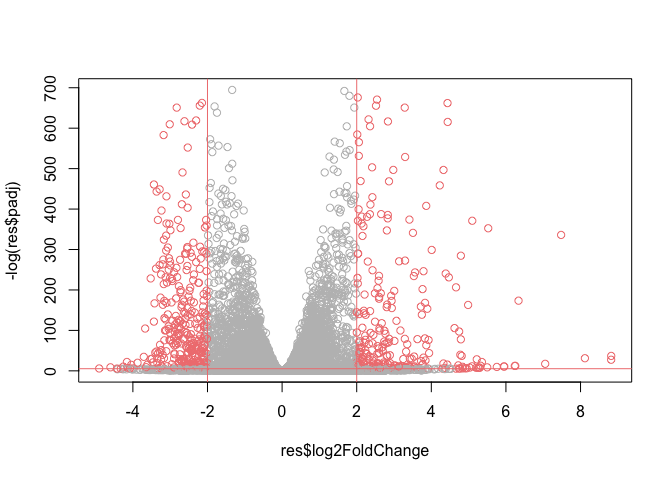

# Class 14: DESeq Mini Project
Allen (A16897142)

- [Required Libraries](#required-libraries)
- [Data Import](#data-import)
- [Tidying Up Data](#tidying-up-data)
- [Remove Zero Count Genes](#remove-zero-count-genes)
- [Setup DESeq object for analysis](#setup-deseq-object-for-analysis)
- [Run DESeq analysis](#run-deseq-analysis)
- [Extract Results](#extract-results)
- [Add Gene Annotation](#add-gene-annotation)
- [Save my results to a CSV file](#save-my-results-to-a-csv-file)
- [Result Visualization](#result-visualization)
- [Pathway Analysis](#pathway-analysis)
  - [Reactome Analysis Online](#reactome-analysis-online)

# Required Libraries

``` r
library(DESeq2)
```

    Loading required package: S4Vectors

    Loading required package: stats4

    Loading required package: BiocGenerics


    Attaching package: 'BiocGenerics'

    The following objects are masked from 'package:stats':

        IQR, mad, sd, var, xtabs

    The following objects are masked from 'package:base':

        anyDuplicated, aperm, append, as.data.frame, basename, cbind,
        colnames, dirname, do.call, duplicated, eval, evalq, Filter, Find,
        get, grep, grepl, intersect, is.unsorted, lapply, Map, mapply,
        match, mget, order, paste, pmax, pmax.int, pmin, pmin.int,
        Position, rank, rbind, Reduce, rownames, sapply, saveRDS, setdiff,
        table, tapply, union, unique, unsplit, which.max, which.min


    Attaching package: 'S4Vectors'

    The following object is masked from 'package:utils':

        findMatches

    The following objects are masked from 'package:base':

        expand.grid, I, unname

    Loading required package: IRanges

    Loading required package: GenomicRanges

    Loading required package: GenomeInfoDb

    Loading required package: SummarizedExperiment

    Loading required package: MatrixGenerics

    Loading required package: matrixStats


    Attaching package: 'MatrixGenerics'

    The following objects are masked from 'package:matrixStats':

        colAlls, colAnyNAs, colAnys, colAvgsPerRowSet, colCollapse,
        colCounts, colCummaxs, colCummins, colCumprods, colCumsums,
        colDiffs, colIQRDiffs, colIQRs, colLogSumExps, colMadDiffs,
        colMads, colMaxs, colMeans2, colMedians, colMins, colOrderStats,
        colProds, colQuantiles, colRanges, colRanks, colSdDiffs, colSds,
        colSums2, colTabulates, colVarDiffs, colVars, colWeightedMads,
        colWeightedMeans, colWeightedMedians, colWeightedSds,
        colWeightedVars, rowAlls, rowAnyNAs, rowAnys, rowAvgsPerColSet,
        rowCollapse, rowCounts, rowCummaxs, rowCummins, rowCumprods,
        rowCumsums, rowDiffs, rowIQRDiffs, rowIQRs, rowLogSumExps,
        rowMadDiffs, rowMads, rowMaxs, rowMeans2, rowMedians, rowMins,
        rowOrderStats, rowProds, rowQuantiles, rowRanges, rowRanks,
        rowSdDiffs, rowSds, rowSums2, rowTabulates, rowVarDiffs, rowVars,
        rowWeightedMads, rowWeightedMeans, rowWeightedMedians,
        rowWeightedSds, rowWeightedVars

    Loading required package: Biobase

    Welcome to Bioconductor

        Vignettes contain introductory material; view with
        'browseVignettes()'. To cite Bioconductor, see
        'citation("Biobase")', and for packages 'citation("pkgname")'.


    Attaching package: 'Biobase'

    The following object is masked from 'package:MatrixGenerics':

        rowMedians

    The following objects are masked from 'package:matrixStats':

        anyMissing, rowMedians

``` r
library(AnnotationDbi)
library(org.Hs.eg.db)
```

``` r
library(pathview)
```

    ##############################################################################
    Pathview is an open source software package distributed under GNU General
    Public License version 3 (GPLv3). Details of GPLv3 is available at
    http://www.gnu.org/licenses/gpl-3.0.html. Particullary, users are required to
    formally cite the original Pathview paper (not just mention it) in publications
    or products. For details, do citation("pathview") within R.

    The pathview downloads and uses KEGG data. Non-academic uses may require a KEGG
    license agreement (details at http://www.kegg.jp/kegg/legal.html).
    ##############################################################################

``` r
library(gage)
```

``` r
library(gageData)
```

# Data Import

``` r
colData <- read.csv("GSE37704_metadata.csv", row.names = 1)
countData <- read.csv("GSE37704_featurecounts.csv", row.names = 1)
head(colData)
```

                  condition
    SRR493366 control_sirna
    SRR493367 control_sirna
    SRR493368 control_sirna
    SRR493369      hoxa1_kd
    SRR493370      hoxa1_kd
    SRR493371      hoxa1_kd

``` r
head(countData)
```

                    length SRR493366 SRR493367 SRR493368 SRR493369 SRR493370
    ENSG00000186092    918         0         0         0         0         0
    ENSG00000279928    718         0         0         0         0         0
    ENSG00000279457   1982        23        28        29        29        28
    ENSG00000278566    939         0         0         0         0         0
    ENSG00000273547    939         0         0         0         0         0
    ENSG00000187634   3214       124       123       205       207       212
                    SRR493371
    ENSG00000186092         0
    ENSG00000279928         0
    ENSG00000279457        46
    ENSG00000278566         0
    ENSG00000273547         0
    ENSG00000187634       258

# Tidying Up Data

``` r
colnames(countData)
```

    [1] "length"    "SRR493366" "SRR493367" "SRR493368" "SRR493369" "SRR493370"
    [7] "SRR493371"

``` r
counts <- countData[,-1]
head(counts)
```

                    SRR493366 SRR493367 SRR493368 SRR493369 SRR493370 SRR493371
    ENSG00000186092         0         0         0         0         0         0
    ENSG00000279928         0         0         0         0         0         0
    ENSG00000279457        23        28        29        29        28        46
    ENSG00000278566         0         0         0         0         0         0
    ENSG00000273547         0         0         0         0         0         0
    ENSG00000187634       124       123       205       207       212       258

``` r
all(rownames(colData) == colnames(counts))
```

    [1] TRUE

# Remove Zero Count Genes

Some rows in `counts` for genes that we can not say anything about
because they have zero expression in the particular tissue we are
looking at.

``` r
head(counts)
```

                    SRR493366 SRR493367 SRR493368 SRR493369 SRR493370 SRR493371
    ENSG00000186092         0         0         0         0         0         0
    ENSG00000279928         0         0         0         0         0         0
    ENSG00000279457        23        28        29        29        28        46
    ENSG00000278566         0         0         0         0         0         0
    ENSG00000273547         0         0         0         0         0         0
    ENSG00000187634       124       123       205       207       212       258

If the `rowSums()`is zero then we give a gene has not count data and we
should exclude those genes.

``` r
head(rowSums(counts) == 0)
```

    ENSG00000186092 ENSG00000279928 ENSG00000279457 ENSG00000278566 ENSG00000273547 
               TRUE            TRUE           FALSE            TRUE            TRUE 
    ENSG00000187634 
              FALSE 

``` r
to.keep <- rowSums(counts) !=0
cleancounts <- counts[to.keep,]
```

> Q1. How many genes do we have left?

``` r
nrow(cleancounts)
```

    [1] 15975

# Setup DESeq object for analysis

``` r
dds <- DESeqDataSetFromMatrix(countData = cleancounts,
                              colData = colData,
                              design = ~condition)
```

    Warning in DESeqDataSet(se, design = design, ignoreRank): some variables in
    design formula are characters, converting to factors

# Run DESeq analysis

``` r
dds <- DESeq(dds)
```

    estimating size factors

    estimating dispersions

    gene-wise dispersion estimates

    mean-dispersion relationship

    final dispersion estimates

    fitting model and testing

# Extract Results

``` r
res <- results(dds)
head(res)
```

    log2 fold change (MLE): condition hoxa1 kd vs control sirna 
    Wald test p-value: condition hoxa1 kd vs control sirna 
    DataFrame with 6 rows and 6 columns
                     baseMean log2FoldChange     lfcSE       stat      pvalue
                    <numeric>      <numeric> <numeric>  <numeric>   <numeric>
    ENSG00000279457   29.9136      0.1792571 0.3248216   0.551863 5.81042e-01
    ENSG00000187634  183.2296      0.4264571 0.1402658   3.040350 2.36304e-03
    ENSG00000188976 1651.1881     -0.6927205 0.0548465 -12.630158 1.43989e-36
    ENSG00000187961  209.6379      0.7297556 0.1318599   5.534326 3.12428e-08
    ENSG00000187583   47.2551      0.0405765 0.2718928   0.149237 8.81366e-01
    ENSG00000187642   11.9798      0.5428105 0.5215599   1.040744 2.97994e-01
                           padj
                      <numeric>
    ENSG00000279457 6.86555e-01
    ENSG00000187634 5.15718e-03
    ENSG00000188976 1.76549e-35
    ENSG00000187961 1.13413e-07
    ENSG00000187583 9.19031e-01
    ENSG00000187642 4.03379e-01

# Add Gene Annotation

``` r
res$name <- mapIds(x=org.Hs.eg.db,
                    keys=rownames(res),
                    keytype = "ENSEMBL",
                   column = "SYMBOL")
```

    'select()' returned 1:many mapping between keys and columns

``` r
res$entrez <- mapIds(x=org.Hs.eg.db,
                    keys=rownames(res),
                    keytype = "ENSEMBL",
                   column = "ENTREZID")
```

    'select()' returned 1:many mapping between keys and columns

``` r
head(res)
```

    log2 fold change (MLE): condition hoxa1 kd vs control sirna 
    Wald test p-value: condition hoxa1 kd vs control sirna 
    DataFrame with 6 rows and 8 columns
                     baseMean log2FoldChange     lfcSE       stat      pvalue
                    <numeric>      <numeric> <numeric>  <numeric>   <numeric>
    ENSG00000279457   29.9136      0.1792571 0.3248216   0.551863 5.81042e-01
    ENSG00000187634  183.2296      0.4264571 0.1402658   3.040350 2.36304e-03
    ENSG00000188976 1651.1881     -0.6927205 0.0548465 -12.630158 1.43989e-36
    ENSG00000187961  209.6379      0.7297556 0.1318599   5.534326 3.12428e-08
    ENSG00000187583   47.2551      0.0405765 0.2718928   0.149237 8.81366e-01
    ENSG00000187642   11.9798      0.5428105 0.5215599   1.040744 2.97994e-01
                           padj        name      entrez
                      <numeric> <character> <character>
    ENSG00000279457 6.86555e-01          NA          NA
    ENSG00000187634 5.15718e-03      SAMD11      148398
    ENSG00000188976 1.76549e-35       NOC2L       26155
    ENSG00000187961 1.13413e-07      KLHL17      339451
    ENSG00000187583 9.19031e-01     PLEKHN1       84069
    ENSG00000187642 4.03379e-01       PERM1       84808

# Save my results to a CSV file

``` r
write.csv(res, file="results.csv")
```

# Result Visualization

``` r
mycols <- rep("gray", nrow(res))
mycols[res$log2FoldChange <= -2] <- "lightcoral"
mycols[res$log2FoldChange >= 2] <- "lightcoral"
mycols[res$padj >= 0.005] <- "gray"
plot(res$log2FoldChange,-log(res$padj),col=mycols)
abline(v=-2, col="lightcoral")
abline(v=+2, col="lightcoral")
abline(h=-log(0.005),col="lightcoral")
```



``` r
library(ggplot2)
ggplot(as.data.frame(res))+
  aes(log2FoldChange, -log10(padj)) +
  geom_point(col=mycols) +
  scale_color_manual(values = c("gray", "lightcoral")) +
  geom_vline(xintercept = (-2), color = "lightcoral") +    
  geom_vline(xintercept = (2), color = "lightcoral") +
  geom_hline(yintercept = -log10(0.005), color = "lightcoral") +
  labs(x = "log2 Fold Change", y = "-log10 Adjusted P-value", title = "Volcano Plot Depicting Regulation of Genes on a Treatment")+
  theme_bw()
```

    Warning: Removed 1237 rows containing missing values or values outside the scale range
    (`geom_point()`).


# Pathway Analysis

``` r
data(go.sets.hs)
data(go.subs.hs)
```

``` r
foldchanges <- res$log2FoldChange
names(foldchanges) = res$entrez
head(foldchanges)
```

           <NA>      148398       26155      339451       84069       84808 
     0.17925708  0.42645712 -0.69272046  0.72975561  0.04057653  0.54281049 

``` r
gobpsets = go.sets.hs[go.subs.hs$BP]

gobpres = gage(foldchanges, gsets=gobpsets, same.dir=TRUE)
head(gobpres$less,5)
```

                                                p.geomean stat.mean        p.val
    GO:0048285 organelle fission             1.536227e-15 -8.063910 1.536227e-15
    GO:0000280 nuclear division              4.286961e-15 -7.939217 4.286961e-15
    GO:0007067 mitosis                       4.286961e-15 -7.939217 4.286961e-15
    GO:0000087 M phase of mitotic cell cycle 1.169934e-14 -7.797496 1.169934e-14
    GO:0007059 chromosome segregation        2.028624e-11 -6.878340 2.028624e-11
                                                    q.val set.size         exp1
    GO:0048285 organelle fission             5.841698e-12      376 1.536227e-15
    GO:0000280 nuclear division              5.841698e-12      352 4.286961e-15
    GO:0007067 mitosis                       5.841698e-12      352 4.286961e-15
    GO:0000087 M phase of mitotic cell cycle 1.195672e-11      362 1.169934e-14
    GO:0007059 chromosome segregation        1.658603e-08      142 2.028624e-11

``` r
data(kegg.sets.hs)
keggres <- gage(foldchanges, gsets=kegg.sets.hs)
```

``` r
attributes(keggres)
```

    $names
    [1] "greater" "less"    "stats"  

``` r
head(keggres$less)
```

                                                      p.geomean stat.mean
    hsa04110 Cell cycle                            8.995727e-06 -4.378644
    hsa03030 DNA replication                       9.424076e-05 -3.951803
    hsa05130 Pathogenic Escherichia coli infection 1.405864e-04 -3.765330
    hsa03013 RNA transport                         1.246882e-03 -3.059466
    hsa03440 Homologous recombination              3.066756e-03 -2.852899
    hsa04114 Oocyte meiosis                        3.784520e-03 -2.698128
                                                          p.val       q.val
    hsa04110 Cell cycle                            8.995727e-06 0.001889103
    hsa03030 DNA replication                       9.424076e-05 0.009841047
    hsa05130 Pathogenic Escherichia coli infection 1.405864e-04 0.009841047
    hsa03013 RNA transport                         1.246882e-03 0.065461279
    hsa03440 Homologous recombination              3.066756e-03 0.128803765
    hsa04114 Oocyte meiosis                        3.784520e-03 0.132458191
                                                   set.size         exp1
    hsa04110 Cell cycle                                 121 8.995727e-06
    hsa03030 DNA replication                             36 9.424076e-05
    hsa05130 Pathogenic Escherichia coli infection       53 1.405864e-04
    hsa03013 RNA transport                              144 1.246882e-03
    hsa03440 Homologous recombination                    28 3.066756e-03
    hsa04114 Oocyte meiosis                             102 3.784520e-03

``` r
pathview(gene.data=foldchanges, pathway.id="hsa04110")
```

    'select()' returned 1:1 mapping between keys and columns

    Info: Working in directory /Users/AllenSchool/Documents/School Items/BIMM 143/bimm143_github/class14

    Info: Writing image file hsa04110.pathview.png


## Reactome Analysis Online

We need to make a file of our significant genes that we ca upload to the
reactome website:

``` r
sig_genes <- res[res$padj <= 0.05 & !is.na(res$padj), "name"]
print(paste("Total number of significant genes:", length(sig_genes)))
```

    [1] "Total number of significant genes: 8147"

``` r
write.table(sig_genes, file="significant_genes.txt", row.names=FALSE, col.names=FALSE, quote=FALSE)
```


