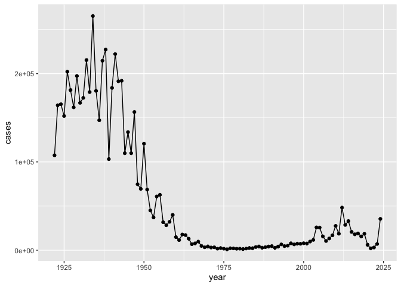
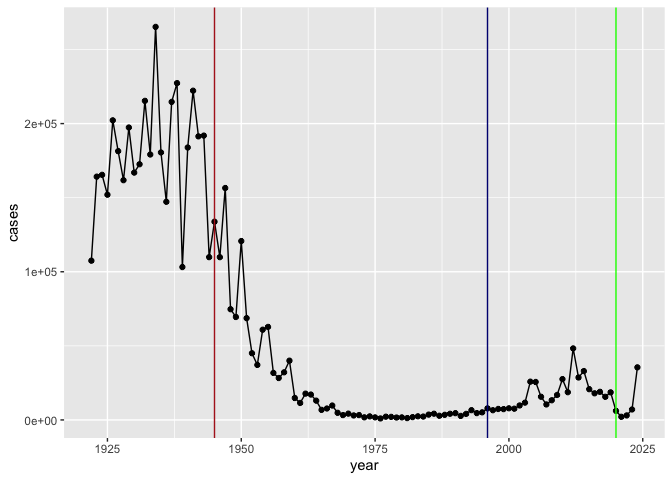
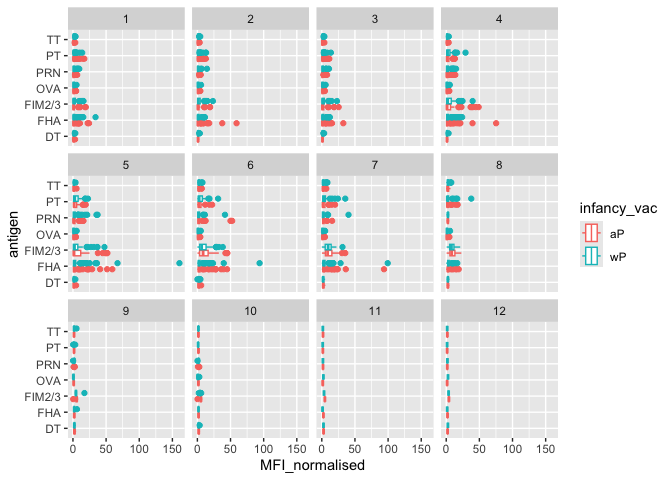

# Class 18: Pertussis Mini Project
Allen (A16897142)

- [Background](#background)
- [Examining Cases](#examining-cases)
- [Entering the CMI-PB project](#entering-the-cmi-pb-project)
- [Focus on IgG Data](#focus-on-igg-data)

## Background

Pertussis (or whooping cough) is a common lung infection cause by the
bacteria *B. Pertussis*. The CDC tracks the cases of Pertussis each
year: https://tinyurl.com/pertussiscdc

## Examining Cases

> Q1. Make a plot of pertussis cases per year using ggplot:

``` r
library(ggplot2)

ggplot(cdc) +
  aes(year, cases) +
  geom_line()+
  geom_point()
```



> Q2. Add some key time points in our history of interactions with
> Pertussis. These include the rollout of the WP vaccine, and the switch
> to the aP vaccine in 1996.

Use `geom_vline()` to add some vertical lines to indicate dates.

``` r
ggplot(cdc) +
  aes(year, cases) +
  geom_line()+
  geom_point()+
  geom_vline(xintercept = 1945, col = "#B22222")+
  geom_vline(xintercept = 1996, col = "navy")+
  geom_vline(xintercept = 2020, col = "green")
```



Mounting evidence suggests that the newer **aP** vaccine is less
effective over long term of disease prevention thatn the **wP** vaccine
that was replaced. This means that vaccine protection wanes more rapidly
with aP over wP. There seems to be an increase of cases after the
introduction and there could be economic reasons, biological reasons, or
social reasons like COVID impacting cases.

## Entering the CMI-PB project

CMI-PB (Computational Models of Immunity = Pertussis boost). There major
goal is to determine the immune response’s difference with aP and wP.

CMI-PB makes their data available freely. They store it in a database
composed different tables. Here we will acess a few of these.

Use **jsonlite** package to read the data

``` r
library(jsonlite)

subject <- read_json("https://www.cmi-pb.org/api/v5_1/subject", simplifyVector = TRUE)
```

> Q3. How many subjects are there in this dataset?

``` r
nrow(subject)
```

    [1] 172

> Q4. How many “aP” and “wP” are there?

``` r
table(subject$infancy_vac)
```


    aP wP 
    87 85 

> Q5. How many Male/Female are in this dataset?

``` r
table(subject$biological_sex)
```


    Female   Male 
       112     60 

> Q6. How about gender and race number?

``` r
table(subject$race, subject$biological_sex)
```

                                               
                                                Female Male
      American Indian/Alaska Native                  0    1
      Asian                                         32   12
      Black or African American                      2    3
      More Than One Race                            15    4
      Native Hawaiian or Other Pacific Islander      1    1
      Unknown or Not Reported                       14    7
      White                                         48   32

> Q7. Is this representative of the US population?

Heck to the no! This is UCSD students demographics.

Let’s read another table：

``` r
specimen <- read_json("https://www.cmi-pb.org/api/v5_1/specimen", simplifyVector = TRUE)

ab_data <- read_json("http://cmi-pb.org/api/v5_1/plasma_ab_titer", simplifyVector = TRUE)
```

``` r
head(specimen)
```

      specimen_id subject_id actual_day_relative_to_boost
    1           1          1                           -3
    2           2          1                            1
    3           3          1                            3
    4           4          1                            7
    5           5          1                           11
    6           6          1                           32
      planned_day_relative_to_boost specimen_type visit
    1                             0         Blood     1
    2                             1         Blood     2
    3                             3         Blood     3
    4                             7         Blood     4
    5                            14         Blood     5
    6                            30         Blood     6

We want to link these tables together. We will be using **dplyr**
package and the `inner_join()` function.

``` r
library(dplyr)
```


    Attaching package: 'dplyr'

    The following objects are masked from 'package:stats':

        filter, lag

    The following objects are masked from 'package:base':

        intersect, setdiff, setequal, union

``` r
meta <- inner_join(subject, specimen)
```

    Joining with `by = join_by(subject_id)`

``` r
head(meta)
```

      subject_id infancy_vac biological_sex              ethnicity  race
    1          1          wP         Female Not Hispanic or Latino White
    2          1          wP         Female Not Hispanic or Latino White
    3          1          wP         Female Not Hispanic or Latino White
    4          1          wP         Female Not Hispanic or Latino White
    5          1          wP         Female Not Hispanic or Latino White
    6          1          wP         Female Not Hispanic or Latino White
      year_of_birth date_of_boost      dataset specimen_id
    1    1986-01-01    2016-09-12 2020_dataset           1
    2    1986-01-01    2016-09-12 2020_dataset           2
    3    1986-01-01    2016-09-12 2020_dataset           3
    4    1986-01-01    2016-09-12 2020_dataset           4
    5    1986-01-01    2016-09-12 2020_dataset           5
    6    1986-01-01    2016-09-12 2020_dataset           6
      actual_day_relative_to_boost planned_day_relative_to_boost specimen_type
    1                           -3                             0         Blood
    2                            1                             1         Blood
    3                            3                             3         Blood
    4                            7                             7         Blood
    5                           11                            14         Blood
    6                           32                            30         Blood
      visit
    1     1
    2     2
    3     3
    4     4
    5     5
    6     6

``` r
head(ab_data)
```

      specimen_id isotype is_antigen_specific antigen        MFI MFI_normalised
    1           1     IgE               FALSE   Total 1110.21154       2.493425
    2           1     IgE               FALSE   Total 2708.91616       2.493425
    3           1     IgG                TRUE      PT   68.56614       3.736992
    4           1     IgG                TRUE     PRN  332.12718       2.602350
    5           1     IgG                TRUE     FHA 1887.12263      34.050956
    6           1     IgE                TRUE     ACT    0.10000       1.000000
       unit lower_limit_of_detection
    1 UG/ML                 2.096133
    2 IU/ML                29.170000
    3 IU/ML                 0.530000
    4 IU/ML                 6.205949
    5 IU/ML                 4.679535
    6 IU/ML                 2.816431

``` r
abdata <- inner_join(ab_data, meta)
```

    Joining with `by = join_by(specimen_id)`

``` r
head(abdata)
```

      specimen_id isotype is_antigen_specific antigen        MFI MFI_normalised
    1           1     IgE               FALSE   Total 1110.21154       2.493425
    2           1     IgE               FALSE   Total 2708.91616       2.493425
    3           1     IgG                TRUE      PT   68.56614       3.736992
    4           1     IgG                TRUE     PRN  332.12718       2.602350
    5           1     IgG                TRUE     FHA 1887.12263      34.050956
    6           1     IgE                TRUE     ACT    0.10000       1.000000
       unit lower_limit_of_detection subject_id infancy_vac biological_sex
    1 UG/ML                 2.096133          1          wP         Female
    2 IU/ML                29.170000          1          wP         Female
    3 IU/ML                 0.530000          1          wP         Female
    4 IU/ML                 6.205949          1          wP         Female
    5 IU/ML                 4.679535          1          wP         Female
    6 IU/ML                 2.816431          1          wP         Female
                   ethnicity  race year_of_birth date_of_boost      dataset
    1 Not Hispanic or Latino White    1986-01-01    2016-09-12 2020_dataset
    2 Not Hispanic or Latino White    1986-01-01    2016-09-12 2020_dataset
    3 Not Hispanic or Latino White    1986-01-01    2016-09-12 2020_dataset
    4 Not Hispanic or Latino White    1986-01-01    2016-09-12 2020_dataset
    5 Not Hispanic or Latino White    1986-01-01    2016-09-12 2020_dataset
    6 Not Hispanic or Latino White    1986-01-01    2016-09-12 2020_dataset
      actual_day_relative_to_boost planned_day_relative_to_boost specimen_type
    1                           -3                             0         Blood
    2                           -3                             0         Blood
    3                           -3                             0         Blood
    4                           -3                             0         Blood
    5                           -3                             0         Blood
    6                           -3                             0         Blood
      visit
    1     1
    2     1
    3     1
    4     1
    5     1
    6     1

> Q8. How many antibody isotypes are there?

``` r
table(abdata$isotype)
```


      IgE   IgG  IgG1  IgG2  IgG3  IgG4 
     6698  7265 11993 12000 12000 12000 

> Q9. How many different antigens are measured in the dataset?

``` r
table(abdata$antigen)
```


        ACT   BETV1      DT   FELD1     FHA  FIM2/3   LOLP1     LOS Measles     OVA 
       1970    1970    6318    1970    6712    6318    1970    1970    1970    6318 
        PD1     PRN      PT     PTM   Total      TT 
       1970    6712    6712    1970     788    6318 

> Q10. Make a boxplot of antigen levels across the whole dataset:

``` r
ggplot(abdata)+
  aes(MFI, antigen) +
  geom_boxplot()
```

    Warning: Removed 1 row containing non-finite outside the scale range
    (`stat_boxplot()`).


> Q.11 Are there any obvious differences between aP and wP values?

``` r
ggplot(abdata)+
  aes(MFI, antigen, col=infancy_vac) +
  geom_boxplot()
```

    Warning: Removed 1 row containing non-finite outside the scale range
    (`stat_boxplot()`).


## Focus on IgG Data

``` r
igg <- abdata |> filter(isotype == "IgG")

head(igg)
```

      specimen_id isotype is_antigen_specific antigen        MFI MFI_normalised
    1           1     IgG                TRUE      PT   68.56614       3.736992
    2           1     IgG                TRUE     PRN  332.12718       2.602350
    3           1     IgG                TRUE     FHA 1887.12263      34.050956
    4          19     IgG                TRUE      PT   20.11607       1.096366
    5          19     IgG                TRUE     PRN  976.67419       7.652635
    6          19     IgG                TRUE     FHA   60.76626       1.096457
       unit lower_limit_of_detection subject_id infancy_vac biological_sex
    1 IU/ML                 0.530000          1          wP         Female
    2 IU/ML                 6.205949          1          wP         Female
    3 IU/ML                 4.679535          1          wP         Female
    4 IU/ML                 0.530000          3          wP         Female
    5 IU/ML                 6.205949          3          wP         Female
    6 IU/ML                 4.679535          3          wP         Female
                   ethnicity  race year_of_birth date_of_boost      dataset
    1 Not Hispanic or Latino White    1986-01-01    2016-09-12 2020_dataset
    2 Not Hispanic or Latino White    1986-01-01    2016-09-12 2020_dataset
    3 Not Hispanic or Latino White    1986-01-01    2016-09-12 2020_dataset
    4                Unknown White    1983-01-01    2016-10-10 2020_dataset
    5                Unknown White    1983-01-01    2016-10-10 2020_dataset
    6                Unknown White    1983-01-01    2016-10-10 2020_dataset
      actual_day_relative_to_boost planned_day_relative_to_boost specimen_type
    1                           -3                             0         Blood
    2                           -3                             0         Blood
    3                           -3                             0         Blood
    4                           -3                             0         Blood
    5                           -3                             0         Blood
    6                           -3                             0         Blood
      visit
    1     1
    2     1
    3     1
    4     1
    5     1
    6     1

``` r
ggplot(igg)+
  aes(MFI_normalised, antigen, col=infancy_vac)+
  geom_boxplot()+
  facet_wrap(~visit)
```



Let’s focus further in one of these antigens and pick **PT**, the main
toxin of the bacteria in the **2021_dataset** again for **IgG** antibody
isotype.

``` r
table(igg$dataset)
```


    2020_dataset 2021_dataset 2022_dataset 2023_dataset 
            1182         1617         1456         3010 

``` r
pt_igg <- abdata |> filter(isotype == "IgG", antigen == "PT", dataset == "2021_dataset")
```

``` r
dim(pt_igg)
```

    [1] 231  20

``` r
ggplot(pt_igg)+
  aes(actual_day_relative_to_boost,
      MFI_normalised,
      col=infancy_vac,
      group=subject_id)+
  geom_point()+
  geom_line()+
  theme_bw()+
  geom_vline(xintercept=0)+
  geom_vline(xintercept=14)
```


